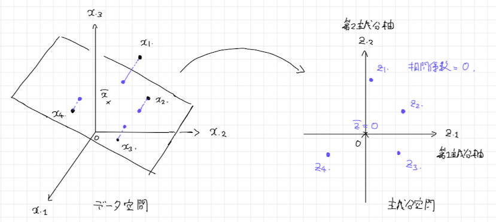

# 1. 前準備
複数の変数からなるデータをより少ない変数で表現するタスクを**次元削減**（dimensionality reduction） といいます。一般論として、変数の多いデータを分析することは容易ではありません。散布図による可視化でデータを理解しようとしても、かかれる散布図の数は多くなり、その考察は難しくなります。しかし、次元削減の手法によって少ない変数でデータを表現することができれば、この問題を解決できる可能性があります。

**例** : Iさんは、ラーメン春木屋の店員です。彼は、春木屋のラーメンの味が周辺にあるラーメン店と比較してどんな特徴があるのか調べてみようと思いました。そこで、麺・具・スープの味を5段階（1:低〜5:高）で評価したデータをとり、以下のような結果を得ました。

```{r}
# データの読み込み
dat <- read.csv("./data/ramen.csv", fileEncoding = "cp932")
dat
```

今回は、**主成分分析**（Principal Component Analysis）とよばれる次元削減の手法を用いて、この問いを考えていきたいと思います。まずは、主成分分析とは何かを説明しましょう。


# 2. 主成分分析
## 2.1 主成分分析の概要
### A. 課題設定
主成分分析は、$d$ 個の変数からなるデータを、より少ない $d'<d$ 個の変数で表現する（いわゆる次元削減とよばれる）手法のひとつです。データの変数を用いた一次式

$$
\begin{align*}
第1主成分 &= a_1\times麺+a_2\times具+a_3\timesスープ
\end{align*}
$$
を考え、分散が一番大きくなるように係数 $a_1,a_2,a_3$ を決めたものを**第1主成分**（First Principal Component）といいます。ただこれだと、係数をとりあえず大きくするだけで、分散は意味もなく大きくなってしまいます。そのようなことを防ぐため、一般には

$$
\begin{align*}
a_1^2+a_2^2+a_3^2 &= 1
\end{align*}
$$

という係数の大きさの制約を設けます。

さらに、第1主成分とは直交するような係数 $b_1,b_2,b_3$（すなわち $a_1b_1+a_2b_2+a_3b_3=0$）を持つ一次式

$$
\begin{align*}
第2主成分 &= b_1\times麺+b_2\times具+b_3\timesスープ
\end{align*}
$$

のうち分散が最大になるものを**第2主成分**といいます。この場合も、$b_1^2+b_2^2+b_3^2=1$ という制約は設けておきます。

これまでの説明を図で表現して、イメージをつかんでおきましょう。

<center></center>

なお、主成分はデータの変数の個数（ラーメンのデータであれば$3$個）まで作ることができます。


### B. 出来ること
主成分分析では、主成分とその寄与率を求めることができます。主成分によって、データに含まれる変数の要約を得られる可能性があります。例えば、主成分分析によって

$$
\begin{align*}
主成分 &= 0.58\times麺+0.58\times具+0.58\timesスープ
\end{align*}
$$
という主成分が得られたとします。この主成分は「味の総合得点」を表していると解釈できるでしょう。

**問題** : 次のような式が主成分として得られたとき、この主成分はどんな意味を表していると解釈できるでしょうか。

$$
\begin{align*}
主成分 &= 0.71\times麺+0.00\times具-0.71\timesスープ
\end{align*}
$$

**解答** : この主成分が正の値のラーメン店はスープより麺重視、負の値のラーメン店は麺よりスープ重視の店です。このことから「麺派・スープ派」といった解釈がつけられるでしょう。■

**Remark** : 主成分分析から得られるのは、あくまで主成分を定義する1次式の係数のみです。得られた主成分に意味があるのか、また意味があるならどう解釈するのかは、分析者が考える必要があります。主成分分析を闇雲に信じるのではなく、意味のある結果が得られているかを必ず考察するように注意しましょう。■

また主成分をできる限り全て求めたとき、主成分の分散の合計はデータの変数の分散の合計に一致することが知られています。つまり、

$$
\begin{align*}
第1主成分の分散+第2主成分の分散+第3主成分の分散 &= 麺の分散+具の分散+スープの分散
\end{align*}
$$

が成り立ちます。このことから、

$$
\begin{align*}
第i主成分の寄与率 &= \frac{第i主成分の分散}{麺の分散+具の分散+スープの分散}
\end{align*}
$$

を主成分の**寄与率**とよび、データのどれくらいの情報をその主成分で要約できたかを表す指標として用いることが一般的です。


## 3. 主成分の係数を求める仕組み
主成分分析を行うことで、主成分の係数を求めることができます。ここでは、その仕組みの解説として、第1主成分の係数の求め方を説明することにしましょう。


### A. 問題設定
簡単のため、次のようなデータを考えます。

|id|$x_1$|$x_2$|
|:-:|:-:|:-:|
|1|$p_1$|$q_1$|
|2|$p_2$|$q_2$|
|平均|$0$|$0$|

なお、簡単のため $x_1,x_2$ の平均値は $0$ に中心化されているものとします。なお、$x_1$ の分散が $(p_1^2+p_2^2)/2$、$x_2$ の分散が $(q_1^2+q_2^2)/2$、$x_1$ と $x_2$ の共分散が $(p_1q_1+p_2q_2)/2$、すなわち分散共分散行列が

$$
\begin{align*}
分散共分散行列&=\begin{pmatrix}
\frac{p_1^2+p_2^2}{2}& \frac
{p_1q_1+p_2q_2}{2}\\
\frac{p_1q_1+p_2q_2}{2}& \frac{q_1^2+q_2^2}{2}
\end{pmatrix}
\end{align*}
$$
になります。この話は後で役に立つので、念頭に置いておくと良いでしょう。

さて、このデータの第1主成分 $z$ を求めることは、

$$
\begin{align*}
z &= a_1x_1+a_2x_2
\end{align*}
$$
の分散が最も大きくなるような係数 $a_1$, $a_2$ を求めることです。なお、係数を大きくすれば主成分の分散を無意味に大きくできてしまうので、$a_1^2+a_2^2=1$ という制約を設けるのでした。


### B. 主成分の分散を式で表現する。
主成分の分散を $a_1,a_2,p_1,p_2,q_1,q_2$ を用いて表すことで、どんな式を最大化するような $a_1,a_2$ を求めれば良いのかを明らかにしましょう。

主成分 $z=a_1x_1+a_2x_2$ について、`id=1`の得点は $z_1=a_1p_1+a_2q_1$、`id=2`の得点は $z_2=a_1p_2+a_2q_2$ になっています。$x_1,x_2$ の平均値は $0$ ですから、主成分 $z$ の平均値もまた $0$ です。このことから主成分 $z$ の分散は

$$
\begin{align*}
主成分zの分散 &= \frac{(a_1p_1+a_2q_1)^2+(a_1p_2+a_2q_2)^2}{2}
\end{align*}
$$

と求めることができます。つまり、主成分の係数 $a_1,a_2$ を求めることは、関数

$$
\begin{align*}
f(a_1,a_2) &= \frac{(a_1p_1+a_2q_1)^2+(a_1p_2+a_2q_2)^2}{2}
\end{align*}
$$

を制約条件 $a_1^2+a_2^2=1$ をみたすように最大化する $a_1, a_2$ を求めなさいという数学の問題を解くことだとわかるわけです。

### C. ラグランジュの未定乗数法
一般に、関数 $f(a_1,a_2)$ を制約条件 $g(a_1,a_2)=0$ をみたすように最大化する $a_1,a_2$ の値について以下の事実が成り立つことが知られています：関数 $F(a_1,a_2,\lambda)=f(a_1,a_2)-\lambda g(a_1,a_2)$ としたとき、関数 $f(a_1,a_2)$ を最大化する値 $a_1,a_2$ は連立方程式

$$
\begin{align*}
\frac{\partial F}{\partial a_1}&=0\\
\frac{\partial F}{\partial a_2}&=0\\
\frac{\partial F}{\partial \lambda}&=0\\
\end{align*}
$$

の解である。これを**ラグランジュの未定乗数法**といいます。

ラグランジュの未定乗数法を用いれば、主成分分析の係数 $a_1,a_2$ を求めるための問題を解くことができます。関数 $F(a_1,a_2,\lambda)$ は

$$
\begin{align*}
F(a_1,a_2,\lambda)&=\displaystyle\frac{(a_1p_1+a_2q_1)^2+(a_1p_2+a_2q_2)^2}{2}-\lambda(a_1^2+a_2^2-1)
\end{align*}
$$ 

なので、解く連立方程式は

$$
\begin{align*}
(a_1p_1+a_2q_1)p_1+(a_1p_2+a_2q_2)p_2-2\lambda a_1 &= 0\\
(a_1p_1+a_2q_1)q_1+(a_1p_2+a_2q_2)q_2-2\lambda a_2 &= 0\\
a_1^2+a_2^2-1&=0
\end{align*}
$$

です。式を $a_1,a_2$ に注目して整理すると、連立方程式を次のように書き換えることができます。

$$
\begin{align*}
\frac{(p_1^2+p_2^2)}{2}a_1 + \frac{(p_1q_1+p_2q_2)}{2}a_2 &= \lambda a_1\\
\frac{(p_1q_1+p_2q_2)}{2}a_1 + \frac{(q_1^2+q_2^2)}{2}a_2 &= \lambda a_2\\
a_1^2+a_2^2&= 1
\end{align*}
$$

### D. 行列で表現してみる。
`C. ラグランジュの未定乗数法`で得られた連立方程式を行列で表現してみましょう。

$$
\begin{align*}
\begin{pmatrix}
\frac{p_1^2+p_2^2}{2}& \frac
{p_1q_1+p_2q_2}{2}\\
\frac{p_1q_1+p_2q_2}{2}& \frac{q_1^2+q_2^2}{2}
\end{pmatrix}\begin{pmatrix}a_1\\a_2\end{pmatrix} &= \lambda\begin{pmatrix}a_1\\a_2\end{pmatrix}\\
a_1^2+a_2^2&= 1
\end{align*}
$$

すると、主成分の係数 $a_1,a_2$ は「分散共分散行列の固有ベクトル」で、特に大きさが $1$ のものだということがわかります。

**Remark** : さらに固有値は主成分の分散の値に等しくなることもわかります。この証明は容易ではないので省略させてください。

以上で、主成分分析で主成分の係数を求める仕組みは、分散共分散行列の固有値問題を解くことだということを解説しました。次回は、`R`言語の固有値問題を解く関数である`eigen`関数を用いて、ラーメン店のデータの主成分分析を行います。また、`R`言語の主成分分析を行う`prcomp`関数を用いて主成分分析を行い、結果を`eigen`関数で得られたものと比較します。