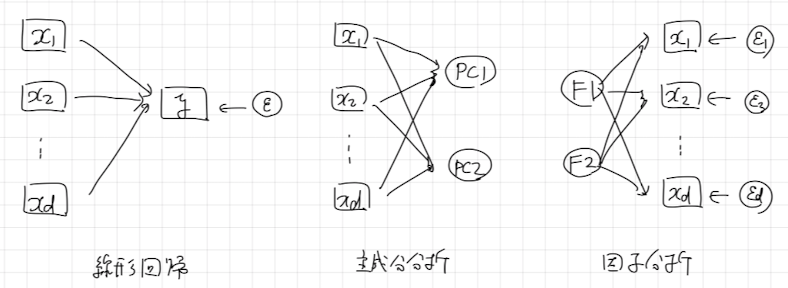
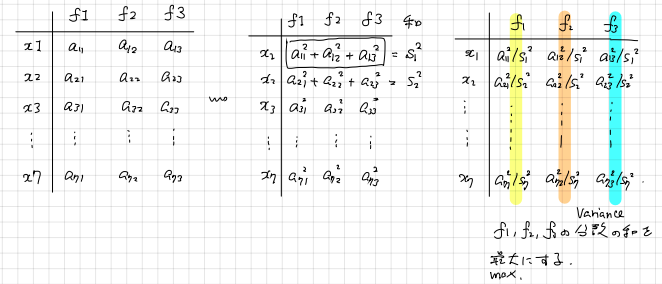

# 1. 前準備
主成分分析と同様に、複数の変数からなるデータをより少ない変数で表現する手法として**探索的因子分析**（exploratory factor analysis）があります。今回は、ラーメンデータを用いながら探索的因子分析のイメージをつかんでみましょう。

# 2. 探索的因子分析
## A. 概要
探索的因子分析は、第1因子・第2因子といったデータには観測されていない変数によって、データに観測されている麺や具やスープの味を説明できるのではないかと考えるモデルです。第1因子や第2因子のことを**共通因子**といいます。また、共通因子は2個に限らず、さまざまな個数を考えることができます。

$$
\begin{align*}
麺の標準化得点 &= a_{11}第1因子 + a_{12}第2因子 + 麺の独自因子\\
具の標準化得点 &= a_{21}第1因子 + a_{22}第2因子 + 具の独自因子\\
スープの標準化得点 &= a_{31}第1因子 + a_{32}第2因子 + スープの独自因子
\end{align*}
$$

係数 $a_{ij}$ を**因子負荷量**（loadings）、各データ点の因子の値を**因子得点**（factor score）といいます。また、データに含まれる変数それぞれに対して、因子で説明できなかった誤差に対応する項を**独自因子**（unique factor）といいます。

各共通因子は期待値 $0$, 分散 $1$ とします。独自因子の期待値は $0$ とし、各変数の独自因子間には相関はないものとします。なお、因子と独自因子との間の相関はないものとします。

**問題** : パス図とよばれるものを使うことで因子分析の式をイメージしやすくすることができます。講師の説明を聞きながら、線形回帰・主成分分析・因子分析のパス図をかいてみましょう。

**解答** : 

<center></center>

## B. できること
探索的因子分析では、

* **因子負荷量** : 得られた因子を解釈するためのヒント
* **共通性**・**独自性** : 各変数が因子によってどれだけ説明されているか
* **因子得点** : 各データ点の因子の値

の3つが得られます。また、**回転**（rotation）とよばれるものを選択することで、因子の間に相関を許すかを決めることができます。許した場合は、**因子間相関**が得られます。

## C. 仕組み
探索的因子分析では、まず因子負荷量と独自因子の分散の2つを求めます。求め方には最尤法や最小二乗法といった方法が知られています。この具体的な話は難しいので説明を省略させてください。探索的因子分析では、あらかじめ標準化した変数を考えます。そのため変数の分散は $1$ であり `1-独自因子の分散` は因子によって変数がどれだけ説明されたかを意味していると解釈できます。`1-独自因子の分散`を共通性、`独自因子の分散`を独自性といいます。

**Remark** : 共通性はいわゆる「データの変数に対する因子の決定係数」と解釈することができます。■

さて次に、因子負荷量から因子の解釈をおこないます。ところで、因子負荷量と因子得点には無数の解があることが知られています。以下の問題を確認してみてください。

**問題** : 以下の問いに答えてください。

1. 行列を用いて因子分析の式を表してみてください。
2. 回転行列を用いて、因子負荷量と因子得点には無数の解があることを示してください。

**解答** : 

1. $A=(a_{ij})$、$e=(麺の独自因子, 具の独自因子, スープの独自因子)$
とします。また、データを $X$、因子得点を表す行列を $F$ で行列で表すことにします。このとき、$X=AF+e$ となります。

2. 回転行列とは、次のような行列のことです。
$$
\begin{align*}
R(\theta) &= \begin{pmatrix}\cos\theta&\sin(-\theta)\\\sin\theta&\cos\theta\end{pmatrix}
\end{align*}
$$
回転行列には $R(\theta)R(-\theta)=I_{2}$ という性質があります。これを用いると、$A'=AR(\theta)$, $F'=R(-\theta)F$ とおくことで
$$
\begin{align*}
AF+e &= A'F'+e
\end{align*}
$$
が成り立つので、因子負荷量と因子得点には無数の解があることがわかります。■

そこで、ひとまず解の候補を一つ求めておいて、**回転**（rotation）という操作により解釈しやすい結果を探していきます。ひとまず求めた一つの解を**無回転解**といいます。回転の代表例には**バリマックス回転**（varimax rotation）と**プロマックス回転**（promax rotation）があり、共通因子の間に相関を認めない場合にはバリマックス回転、認める場合にプロマックス回転が用いられます。バリマックス回転とプロマックス回転の詳細については、3節でデモを示してから、改めて4節で説明します。

最後に因子得点を予測します。一般には、データの変数の1次式

$$
\begin{align*}
第1因子の予測値 &= w_{11}麺の標準化得点 + w_{12}具の標準化得点 + w_{13}スープの標準化得点\\
第2因子の予測値 &= w_{21}麺の標準化得点 + w_{22}具の標準化得点 + w_{23}スープの標準化得点\\
\end{align*}
$$

を考え、係数 $w_{ij}$ を最小二乗法で求めます。

**Remark** : 因子得点は観測されていない値であり、また因子分析の中で推定される値でもありません。このことから、最小二乗法を行うときの正解が見当たらず、「最小二乗法」と言われてもどうやってやるのか不可解に感じる方もいるでしょう。実は、最小化したい誤差の分散は

* 因子得点の分散共分散行列（対角行列 or 因子相関の推定値）
* 因子負荷量の推定値
* データの分散共分散行列

さえわかっていれば計算できることを確認することができます。ここで「因子得点の分散共分散行列」が既知であることから、因子得点の真の値を知る必要はないという仕組みになっています。


# 3. `fa`関数を用いた探索的因子分析
## A. パッケージの読み込み
因子分析は `psych` パッケージの `fa` 関数を用いて計算することができます。`psych` パッケージをインストールして、読み込んでおきましょう。

```{r}
# faパッケージの読み込み
# install.packages("psych")
library(psych)
```


## B. ラーメンデータの紹介
主成分分析で用いたラーメンデータに因子分析を行っていきましょう。Iさんは、ラーメン春木屋の店員です。彼は、春木屋のラーメンの味が周辺にあるラーメン店と比較してどんな特徴があるのか調べてみようと思いました。そこで、麺・具・スープの味を5段階（1:低〜5:高）で評価したデータをとり、以下のような結果を得ました。

```{r}
# データの読み込み
dat <- read.csv("./data/ramen.csv", fileEncoding = "cp932", row.names = "店名")
dat
```


## C. 因子負荷量の初期値と共通性を求める
`R`言語では`fa`関数を用いることで、探索的因子分析のさまざまな計算を実行できます。まずは因子負荷量の無回転解を求め、その共通性を確認します。今回は、2因子モデルを想定して、無回転解を求めてみましょう。

```{r}
# 因子負荷量の初期値
result_none <- fa(dat, nfactors = 2, fm = "ml", rotate = "none")
print(result_none$loadings, cutoff = 0)
```

```{r}
# 共通性
result_none$communalities
```

**問題** : 得られた結果を因子分析の式で表してください。

**解答** : 
$$
\begin{align*}
麺の標準化得点 &= 0.505第1因子 + 0.383第2因子 + 麺の独自因子\\
具の標準化得点 &= 0.372第1因子 + 0.007第2因子 + 具の独自因子\\
スープの標準化得点 &= 0.811第1因子 - 0.131第2因子 + スープの独自因子
\end{align*}
$$

## D. 回転して解釈可能な因子を探す
### バリマックス回転解
共通因子の間の相関は $0$ だと仮定して、解釈可能な因子負荷量を探していきましょう。これには、一つの方法としてバリマックス回転解を求めるという方法があります。

```{r}
result_varimax <- fa(dat, nfactors = 2, fm = "ml", rotate = "varimax")
print(result_varimax$loadings, cutoff = 0)
```

```{r}
result_varimax$communalities
```

### プロマックス回転解
バリマックス回転解はあまりしっくりした解釈を行うことができません。そこで今度は、共通因子の間に相関があってもよいとして、解釈可能な因子負荷量を探していきましょう。これには、一つの方法としてプロマックス回転解を求めるという方法があります。

```{r}
result_promax <- fa(dat, nfactors = 2, fm = "ml", rotate = "Promax")
print(result_promax$loadings, cutoff = 0)
```

**問題** : プロマックス回転解の解釈を与えてください。

**解答** : 第1因子は具とスープの美味しさ、第2因子は麺の美味しさ■

```{r}
result_promax$communalities
```

共通因子間の相関、因子間相関の値を確認しておきましょう。
```{r}
# 因子間相関
matrix(result_promax$Phi, ncol = 2)
```

**問題** : なお統計検定準1級では、共通性の値と因子負荷量・因子間相関の間に成り立つ関係が問われることがあります。

$$
麺の標準化得点 = a_{1}第1因子 + a_{2}第2因子 + 独自因子 
$$
という関係が成り立つことに注目し、以下の問いに答えてください。

1. $共通性=1-独自性$ という定義に注意して、$共通性=a_1^2+a_2^2+2a_1a_2因子間相関$ が成り立つことを証明してください。
2. 麺の因子負荷量がそれぞれ、$a_{1}=-0.029$, $a_{2}=0.654$、因子間相関が $0.709$ のとき、麺の共通性を求めてください。

**解答** : 

1. 共分散の公式・共通因子と独自因子の無相関性から
$$
麺の標準化得点の分散 = a_1^2第1因子の分散 + a_2^2第2因子の分散 + 2a_1a_2因子相関 + 独自性
$$
が従いますが、麺の標準化得点・第1因子・第2因子の分散はすべて $1$ なので $共通性=1-独自性=a_1^2+a_2^2+2a_1a_2因子間相関$ が従います。
2. Rを用いて計算します。
```{r}
(-0.029)^2 + 0.654^2 + 2*(-0.029)*0.654*0.709
```
なお、この計算はプロマックス回転解の結果を参照したものです。実際、プロマックス回転解の麺の共通性は $0.402$ になっています。■


## E. 因子得点を求める
各共通因子が各データ点についていくらであるかを求めたものを因子得点といいます。例えば「春木屋の具とスープの美味しさ（第1因子得点）と麺の美味しさ（第2因子得点）」に興味があるわけです。

```{r}
# 因子得点
result_promax$scores
```

## F. 因子得点を散布図に可視化する
E節で得られた因子得点を散布図に可視化することで、春木屋が他の店に比べて美味しいのか、またどういう特徴があるのかを考察することができます。

```{r}
# 因子得点の散布図
par(family = "ヒラギノ角ゴシック W3")   # Macユーザーのみ
plot(result_promax$scores, type = "n")
text(result_promax$scores, labels=rownames(dat), cex = 0.7)
```

右上の店ほど全体的に味が美味しい店です。春木屋は右上にあるので味が美味しい店であることがわかります。また右に行くほど麺に、上に行くほど具やスープに重点をおいた店です。春木屋は味が美味しい店のなかでも麺に重点を置いていることがわかります。


## 4. 解釈可能な因子負荷量を求めるための工夫

### A. サーストンの単純構造
解釈可能な因子負荷量とは何かを考える上で、1947年に提案された**サーストンの単純構造**という基準が参考になります。ここで、$m$ を因子の数とします。

1. 因子負荷行列の各行には、少なくとも一つの$0$の要素があること。 
2. 因子負荷行列の各列には、$m$ 個以上の$0$の要素があること。
3. 2つの列に注目したとき、一方の列の要素が $0$ で他方の列の要素は $0$ でない行があること。
4. $m\geq4$ のとき、2つの列に注目したときどちらの要素も $0$ である行があること。
5. 二つの列に注目したとき、どちらの要素も $0$ でない行が少ないこと。

以下にのべるバリマックス回転やプロマックス回転は、このサーストンの単純構造をなるべくみたすような因子負荷行列を求める仕組みです。

### B. バリマックス回転
以下のような条件をみたすように因子負荷行列を求めることで、サーストンの単純構造をなるべく持つような因子負荷行列を求めようという考え方を、**（規準化）バリマックス回転**といいます。

<center></center>

なおバリマックス回転は数式で紹介されることが多いので、ここでもその説明を与えておきます。$\lambda_{ij}=a_{ij}/s_{i}$ とおいて、因子負荷行列の各列 $i$ に対して $\lambda_{ij}^2$ の分散を計算し、その和をとった式

$$
\begin{align*}
\sum_{i=1}^{因子数}\left(\sum_{j=1}^{変数の個数}\lambda_{ij}^4-\frac{1}{変数の個数}\left(\sum_{j=1}^{変数の個数}\lambda_{ij}^2\right)^2\right)
\end{align*}
$$
を最小にするように $a_{ij}$ の値を求めたものがバリマックス回転解です。表すにあたっては分散の公式を用いました。


### C. プロマックス回転
バリマックス回転によって得られた因子負荷行列の各要素を4乗して、より因子間の差を強調した行列を**目標行列**（target matrix）といいます。4乗はハイパーパラメータで、実際には3乗を使うこともあります。

```{r}
# 目標行列を求める
x <- result_varimax$loadings
Q <- x * abs(x)^3    # 符号を保つためにabs^3にした。
print(Q, cutoff = 0)
```

この目標行列 $Q$ の作り方は行列の掛け算で表すことができない（非線形な変換の）ため、目標行列をそのまま因子負荷行列に用いることは一般にできません。そこで、バリマックス回転解に正則な行列を掛けることで実現できるような行列のなかで、目標行列 $Q$ に近いものを探します。

```{r}
# バリマックス回転解に掛ける行列の求め方（仕組み）
u <- data.frame(f1_load = x[, 1], f2_load = x[, 2], q = Q[,1])
lm(q ~ 0+f1_load+f2_load, data = u)
```

```{r}
# バリマックス回転解に掛ける行列の求め方（結果）
U <- lm.fit(x, Q)$coefficients    # Qの各列に対して切片0の線形回帰を行う。
U
```

```{r}
# x%*%Uを因子負荷行列にすると因子得点の標準偏差が1にならない。
d <- diag(solve(t(U)%*%U))    # 因子得点の標準偏差を1にするためのスケーリングを求める。
x %*% U %*% diag(sqrt(d))
```


以上でプロマックス回転解が得られます。得られた結果を、`fa`関数で得られたプロマックス回転解と比較してみましょう。
```{r}
# 結果を`fa(rotate="Promax")`と比較してみよう
print(result_promax$loadings, cutoff = 0)
```

