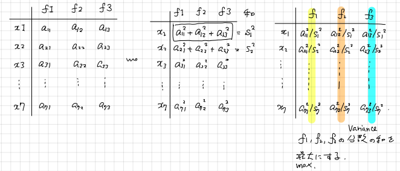

# 1. 探索的因子分析の仕組み
前回は探索的因子分析に入門しました。今回は、その探索的因子分析の仕組みについて、なるべく具体的に説明していこうと思います。

## A. 前準備 : パッケージの読み込み
因子分析は `psych` パッケージの `fa` 関数を用いて計算することができるのでした。`psych` パッケージを読み込んでおきましょう。

```{r}
# psychパッケージの読み込み
library(psych)
```


## B. 因子負荷量と独自因子の分散の推定
探索的因子分析で推定されるのは、因子負荷量と独自因子の分散の値です。推定の方法には最尤法と最小2乗法があります。最尤法は難しいため、ここでは最小2乗法を説明します。

**問題** : データに3変数 $x_1,x_2,x_3$ が記録されているとします。このデータに対して1因子モデルを想定したとき、因子負荷量 $w_1,w_2,w_3$ の値、各変数の独自性  $\sigma_1^2,\sigma_2^2,\sigma_3^2$ を最小2乗法で推定してみましょう。

**解答** : 最小2乗法では、因子分析モデルの相関行列と標本の相関行列の各要素の差の2乗の和が最も小さくなるように、$w_1,w_2,w_3,\sigma_1^2,\sigma_2^2,\sigma_3^2$ の値を決定します。

具体的に考えてみましょう。今回の場合、因子分析モデルの相関行列は次のようになります。

$$
\begin{align*}
\begin{pmatrix}
w_1^2+\sigma_1^2&w_1w_2&w_1w_3\\
w_1w_2&w_2^2+\sigma_2^2&w_2w_3\\
w_1w_3&w_2w_3&w_3^2+\sigma_3^2
\end{pmatrix}
\end{align*}
$$

ここで標本から得られる相関行列が次のようであったとします。

$$
\begin{align*}
\begin{pmatrix}
1&r_{13}&r_{13}\\
r_{12}&1&r_{23}\\
r_{13}&r_{23}&1
\end{pmatrix}
\end{align*}
$$

このとき、各要素の差の2乗の和は次のようになります。

$$
\begin{align*}
L(w,\sigma^2) &= \sum_{i=1}^{3}(w_i^2+\sigma_i^2-1)^2 + 2\sum_{1\leq i<j\leq 3}(w_iw_j-r_{ij})^2
\end{align*}
$$
この関数 $L(w,\sigma^2)$ を最小にするような $w,\sigma^2$ の値を求めるわけです。

なお、$\sigma_1^2,w_1$ でこの関数 $L(w,\sigma^2)$ を微分すると

$$
\begin{align*}
\frac{\partial L}{\partial \sigma_1^2} &= 2(w_i^2+\sigma_i^2-1)\\
\frac{\partial L}{\partial w_1} &= 4w_i(w_i^2+\sigma_i^2-1)+w_2(w_1w_2-r_{12})+w_3(w_1w_3-r_{13})
\end{align*}
$$
が得られます。関数 $L(w,\sigma^2)$ を最小にする $w,\sigma^2$ の値が $\displaystyle\frac{\partial L}{\partial \sigma_1^2}=0,\displaystyle\frac{\partial L}{\partial w_1}=0$ を満たすことに注意すると、$w_1,w_2,w_3$ の値を

$$
\begin{align*}
w_2(w_1w_2-r_{12})+w_3(w_1w_3-r_{13}) &=0\\
w_1(w_1w_2-r_{12})+w_3(w_2w_3-r_{23}) &=0\\
w_1(w_1w_3-r_{13})+w_2(w_2w_3-r_{23}) &=0
\end{align*}
$$
を満たすもののなかで関数 $L(w,\sigma^2)$ が最小になるように求め、$w_i^2+\sigma_i^2-1=0$ によって $\sigma_i^2$ の値を決めればよいことがわかります。

例えば、$r_{12}=r_{23}=r_{32}=1/2$ の場合、上記の連立方程式をみたす $w$ の値は $(w_1,w_2,w_3)=(0,0,0), (1/\sqrt{2},1/\sqrt{2},1/\sqrt{2})$, $(-1/\sqrt{2},-1/\sqrt{2},-1/\sqrt{2})$ の3通りがあります。関数 $L(w,\sigma^2)$ は $w_1,w_2,w_3)=(1/\sqrt{2},1/\sqrt{2},1/\sqrt{2})$, $(-1/\sqrt{2},-1/\sqrt{2},-1/\sqrt{2})$ の場合で最小値 $0$ になるので、解はこの2種類のどちらかを選択すればよいです。

**Remark** : $w_i^2+\sigma_i^2-1=0$ は前回紹介した `共通性=1-独自性` の話に対応しています。■

## B. 回転
前回用いたラーメンデータを例に、回転とはどんなことをしている操作かを説明していきましょう。

```{r}
# データの読み込み
dat <- read.csv("./data/ramen.csv", fileEncoding = "cp932", row.names = "店名")
dat
```

### サーストンの単純構造
解釈可能な因子負荷量とは何かを考える上で、1947年に提案された**サーストンの単純構造**という基準が参考になります。ここで、$m$ を因子の数とします。

1. 因子負荷行列の各行には、少なくとも一つの$0$の要素があること。 
2. 因子負荷行列の各列には、$m$ 個以上の$0$の要素があること。
3. 2つの列に注目したとき、一方の列の要素が $0$ で他方の列の要素は $0$ でない行があること。
4. $m\geq4$ のとき、2つの列に注目したときどちらの要素も $0$ である行があること。
5. 二つの列に注目したとき、どちらの要素も $0$ でない行が少ないこと。

以下にのべるバリマックス回転やプロマックス回転は、このサーストンの単純構造をなるべくみたすような因子負荷行列を求める仕組みです。


### バリマックス回転解
以下のような条件をみたすように因子負荷行列を求めることで、サーストンの単純構造をなるべく持つような因子負荷行列を求めようという考え方を、**（規準化）バリマックス回転**といいます。

<center></center>

なおバリマックス回転は数式で紹介されることが多いので、ここでもその説明を与えておきます。$\lambda_{ij}=a_{ij}/s_{i}$ とおいて、因子負荷行列の各列 $i$ に対して $\lambda_{ij}^2$ の分散を計算し、その和をとった式

$$
\begin{align*}
\sum_{i=1}^{因子数}\left(\sum_{j=1}^{変数の個数}\lambda_{ij}^4-\frac{1}{変数の個数}\left(\sum_{j=1}^{変数の個数}\lambda_{ij}^2\right)^2\right)
\end{align*}
$$
を最小にするように $a_{ij}$ の値を求めたものがバリマックス回転解です。表すにあたっては分散の公式を用いました。

前回は、次のようにしてバリマックス回転解を求めました。

```{r}
result_varimax <- fa(dat, nfactors = 2, fm = "ml", rotate = "varimax")
print(result_varimax$loadings, cutoff = 0)
```


### プロマックス回転解
バリマックス回転によって得られた因子負荷行列の各要素を4乗して、より因子間の差を強調した行列を**目標行列**（target matrix）といいます。4乗はハイパーパラメータで、実際には3乗を使うこともあります。

```{r}
# 目標行列を求める
x <- result_varimax$loadings
Q <- x * abs(x)^3    # 符号を保つためにabs^3にした。
print(Q, cutoff = 0)
```

この目標行列 $Q$ の作り方は行列の掛け算で表すことができない（非線形な変換の）ため、目標行列をそのまま因子負荷行列に用いることは一般にできません。そこで、バリマックス回転解に正則な行列を掛けることで実現できるような行列のなかで、目標行列 $Q$ に近いものを探します。

```{r}
# バリマックス回転解に掛ける行列の求め方（仕組み）
u <- data.frame(f1_load = x[, 1], f2_load = x[, 2], q = Q[,1])
lm(q ~ 0+f1_load+f2_load, data = u)
```

```{r}
# バリマックス回転解に掛ける行列の求め方（結果）
U <- lm.fit(x, Q)$coefficients    # Qの各列に対して切片0の線形回帰を行う。
U
```

```{r}
# x%*%Uを因子負荷行列にすると因子得点の標準偏差が1にならない。
d <- diag(solve(t(U)%*%U))    # 因子得点の標準偏差を1にするためのスケーリングを求める。
x %*% U %*% diag(sqrt(d))
```


以上でプロマックス回転解が得られます。得られた結果を、`fa`関数で得られるプロマックス回転解と比較してみましょう。

```{r}
result_promax <- fa(dat, nfactors = 2, fm = "ml", rotate = "Promax")
print(result_promax$loadings, cutoff = 0)
```


# 2. `mtcars`データセットによる演習

**問題** : `mtcars_numeric.csv` は、1974年の雑誌 "Motor Trend US" から32台の自動車モデルについて、

* `mpg` : 燃費
* `cyl` : シリンダーの数
* `disp` : 排気量
* `hp` : 馬力
* `drat` : rear axle 比
* `wt` : 重量
* `qsec` : ドラッグレースのタイム
* `gear` : ギア数
* `carb` : キャブレーターの数

を抜粋し、記録したデータです。

```{r}
dat <- read.csv("./data/mtcars_numeric.csv", 
                fileEncoding = "utf-8", 
                row.names = "model")
head(dat, n = 5)
```


探索的因子分析を用いて、各自動車モデルの特徴や自動車モデルの間の類似性を把握してみてください。

**解答** : まずはデータの各変数間の相関関係を確認します。相関係数を確認する上で、ヒートマップを用いると便利です。

```{r}
library(corrplot)
cormat <- cor(dat)    # 相関行列の計算
corrplot(cormat)    # ヒートマップの作成
```

相関係数のパターンをみて、`mpg`から`wt`および`gear`の7変数が一つに、`qsec`と`carb`の2変数が一つにまとまる2因子モデルで、因子間には相関があるのではないかと考えました。

そこで、最尤法・プロマックス回転による2因子モデルを行ってみましょう。

```{r}
# 2因子モデル
result <- fa(dat, nfactors = 2, fm = "ml", rotate = "Promax")
result <- fa.sort(result)    # 因子負荷量の絶対値が高い順にソート
result$loadings    # サーストンの単純構造が得られている
```

変数 `hp` については想定とは異なりましたが、第1因子が正に大きいほど操作が煩雑で本格的な自動車、第2因子が正に大きいほどスピードが出せそうな自動車であることがわかります。

因子であまり説明されていないような変数は、除いてから改めて探索的因子分析を行なった方が良いかもしれません。そこで、変数の共通性を確認しておきましょう。今回は、共通性の低い変数は確認できませんでした。

```{r}
result$communalities
```

なお、得られた因子の間には正の相関が確認できます。

```{r}
# 因子間相関
result$Phi
```

各自動車の特徴を抑えるために、因子得点を散布図で可視化しておきましょう。例えば、とにかくスピードを求めている人にはMaserati BoraやFord Pantera Lを勧めるとよいだろうことがわかります。また、スピードをあまり求めず、操作性の難しくない自動車を求めている人には Honda CivicやToyota Corollaを提案するとよいでしょう。

```{r}
# 因子得点の散布図
par(family = "ヒラギノ角ゴシック W3")   # Macユーザーのみ
plot(result$scores, type = "n")
text(result$scores, labels=rownames(dat), cex = 0.7)
```


