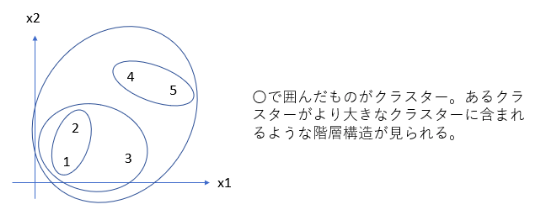
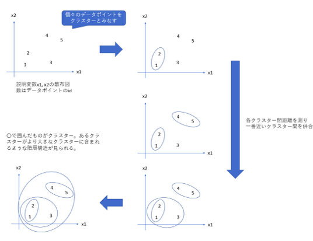
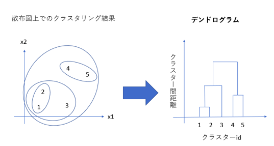
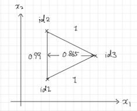

# 1. 概要
**階層クラスタリング**は、k-means法と同様に類似したデータ点をまとめてあげるクラスタリングとよばれる手法の一つです。

# 2. 階層クラスタリングのデモ
## 2.1 必要なライブラリの読み込み
クラスタリングを計算するためのclusterライブラリ、デンドログラムを整形するためのdendextendライブラリが必要になります。

```{r}
# 必要なライブラリのロード
library(cluster)
library(dendextend)
```

## 2.2 データの読み込み
各国の乳製品の消費量のデータを持ちいて、消費量による国のクラスタリングをやってみましょう。

```{r}
dat <- read.csv("./data/dairy_products.csv", 
                fileEncoding = "utf-8",     # WindowsではUTF-8-BOM
                row.names = "country")
head(dat, n = 5)
```

```{r}
plot(dat)
```

## 2.3 データの正規化
階層クラスタリングを行う際には、事前に正規化をおこないます。理由は3.3節で説明します。今回は正規化として標準化を選択しました。

```{r}
dat_scaled <- scale(dat)
```


## 2.4 階層クラスタリングの計算
階層クラスタリングは、`cluster`パッケージの`agnes`関数に以下の値を指定することで計算できます。

* `x` : データ
* `metric` : 距離
* `method` : クラスター間距離

今回は、4つのクラスターに分割してみます。

```{r}
# 階層クラスタリングの計算
result <- agnes(x = dat_scaled, metric = "euclidian",method = "ward")
```

## 2.5 デンドログラムでクラスターを決める
階層クラスタリングを計算するとデンドログラムとよばれるものが出来ます。デンドログラムを参考に、
* クラスター間距離の閾値をどこで切れば適切なクラスターができそうか。
* 各クラスターは他のクラスターと比べてをどういう違いがあるのか。
を検討して、適切なクラスターを決定しましょう。

```{r}
par(family = "ヒラギノ角ゴシック W3")    # Macユーザーのみ実行
dend <- as.dendrogram(result)    # クラスタリング結果をデンドログラムに書きなおす。
labels(dend) <- row.names(dat)   # デンドログラムにラベルを付ける。
plot(dend, main = "乳製品の消費量")
```

クラスター数を決定したら、
* デンドログラムを色付けして、各クラスターに所属する国を明確にする。
* 各クラスターの違いを可視化や数値要約で明確にする。
などを行って、クラスターをしっかり理解しましょう。

```{r}
# 作ったクラスターを可視化する（クラスター数k = 4と決めた場合）
par(family = "ヒラギノ角ゴシック W3")
dend <- color_branches(dend, k = 4)
plot(dend)
```

```{r}
# 作ったクラスターの様子を確認する。
clusters <- cutree(dend, k = 4)    # クラスターのラベルを計算する。
dat[clusters == 1, ]
```

```{r}
plot(dat, col = clusters)
```


# 3.階層クラスタリングの仕組み
## 3.1 アルゴリズムの概要
凝集型階層的クラスタリングでは、事前に2つのクラスター C, C′ のクラスター間距離 d(C,C′) を1つ指定しておいて、距離の近いクラスターどうしを併合していきます。

<center></center>

なお、クラスター間距離 d(C, C') には様々な種類がありますが、3.3節で詳しく紹介するWard法を使うのが一般的です。

さて具体的には、以下のステップを繰り返してクラスターを求めます。

1. 個々のデータポイントを1つのクラスターとみなす。
2. 最初は全てのクラスター間の距離を計算する。
3. 以下の計算を繰り返す。
    a. 最も近接している2つのクラスター C, C′ をみつけて併合する。
    b. データポイントすべてが1つのクラスターとしてまとまったら、この計算を終了する。
    c. 新しく作ったクラスターと既存のクラスターとの距離を計算する。
  
<center></center>

## 3.2 結果の可視化
凝集型階層的クラスタリングの結果はデンドログラムという図によって可視化できます。

<center></center>

デンドログラムは、横軸に各データポイントのラベル、縦軸に併合時のクラスター間距離をとり、木グラフによってクラスターの併合の様子を表現したものです。階層的クラスタリングでは、このデンドログラムを頼りに解釈可能なクラスターを見つけ出すことが重要な作業になります。


## 3.3 クラスター間距離の例：Ward法
クラスター間距離は一般にWard法が用いられます。Ward法の距離は、クラスター C, C′ との距離を併合後の偏差平方和と併合前の偏差平方和の合計の差で表現する手法です。

$$
\begin{align*}
d(C,C') &= \sum_{i\in C\cup C'}\|x_i-\bar{x}_{C\cup C'}\|^2-\left(\sum_{i\in C}\|x_i-\bar{x}_{C}\|^2+\sum_{i\in C'}\|x_i-\bar{x}_{C'}\|^2\right)
\end{align*}
$$

この距離が最も小さいようなクラスターどうしを一つに併合します。Ward法は偏差平方和を用いていることから、説明変数の各列を標準化しておいた方がよいことがわかります。分散の大きい列があると、Ward法の距離がその列に依存して決まってしまい、各列を平等に評価できないためです。

**Remark**：分散分析をご存知の方は、分散分析で2つの群に有意な差があるとはどういう状況を指すことだったかを思い出してみてください。分散分析はWard法によれば、2群間A,Bのクラスター間距離が離れていると有意に差があると判断する手法だと説明できることが分かります。■


# 4. 他のクラスター間距離との比較

Ward法にはしばしば、よりシンプルなクラスター間距離で十分なのではないかという話が聞こえます。実際、他のクラスター間距離の例として

* **重心法**：クラスター中心間の距離をクラスター間距離とする。
* **最短距離法**：最も近い点どうしの距離をクラスター間距離とする。

があり、Ward法に比べてシンプルな定義であることは言うまでもないでしょう。しかし、ここでは重心法や最短距離法には欠点が知られています。この欠点を紹介するなかで、Ward法が階層的クラスタリングを行う際の初手として使いやすい距離であることを説明しましょう。

## 4.1 最短距離法と空間拡散
最短距離法は、最も近い点どうしの距離をクラスター間距離とする凝集型階層的クラスタリングです。この手法には、空間拡散という欠点があります。空間拡散とは、一度併合されて出来たクラスターが他のデータポイントを加速度的に併合していく性質のことです。

空間拡散という性質は、解釈に困るクラスタリングを生成する要因になり、特にデンドログラムでは鎖状構造としてこの現象を確認できます。今回のdairy_products.csvデータセットで最短距離法を試して、デンドログラムを確認してみましょう。

```{r}
# 最短距離法の計算
result <- agnes(x = dat_scaled, metric = "euclidean", method = "single")
# デンドログラム：クラスタリング結果の可視化
dend <- as.dendrogram(result)    # クラスタリング結果をデンドログラムに書きなおす。
labels(dend) <- row.names(dat)    # デンドログラムにラベルを付ける。
par(family = "ヒラギノ角ゴシック W3")
plot(dend, main = "乳製品の消費量")
```

## 4.2 重心法と単調性
重心法はクラスター中心間の距離をクラスター間距離とする凝集型階層的クラスタリングです。この手法には、デンドログラムの単調性がないという欠点があります。デンドログラムの単調性とは、クラスター併合後によりクラスター間距離の小さいクラスター対ができる現象のことです。

**問題** : 次のデータを重心法で階層クラスタリングしたときのデンドログラムをかいてみましょう。

<center></center>

