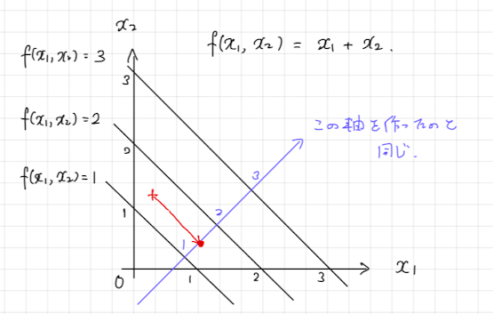
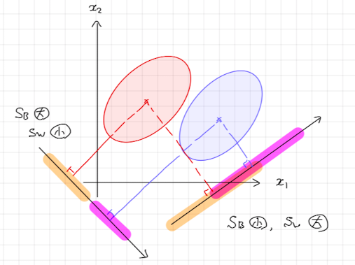

# 1. 概要
**Fisherの線形判別分析**は、`男性/女性`や`clickする/clickしない`のような2種類のラベルのいずれかがデータ点に与えられるとき、このラベルを説明変数からうまく予測するような式を作る方法の一つです。同様の問題を解く手法には、以前紹介したロジスティック回帰がありますが、考え方が大きく異なってきます。

# 2. Fisherの線形判別分析のデモ
## 2.1 データセットの準備
`R`言語にもともと備え付けられている`iris`データセットをデモに用いましょう。話を簡単にするため、事前に以下の処理を行っておいてください。

* 説明変数は `Petal.Length` と `Petal.Width` の2変数のみとする。
* 目的変数は `Species` とし、ラベルは `versicolor` と `virginica` の2種類のみを対象とする。

```{r}
# デモデータセットの作成
data(iris)    # irisデータの読み込み
dat <- iris[iris$Species %in% c("versicolor", "virginica"),
            c("Petal.Length", "Petal.Width", "Species")]
dat$Species <- factor(dat$Species, levels = c("versicolor", "virginica"))
head(dat, n = 5)
```

散布図をかいてデータの様子を確認しておきましょう。

```{r}
plot(dat, col = dat$Species)
```


## 2.2 課題設定
次の課題を考えます。

**課題** : `Petal.Length` と `Petal.Width` の値から `Species` が `versicolor` と `virginica` のどちらであるかを予測する式を作りましょう。


## 2.3 Fisherの線形判別分析
Fisherの線形判別分析によって、そのデータが`versicolor`と`virginica`のどちらなのかを予測するための判別関数

$$
\begin{align*}
f(Petal.Length, Petal.Width) &= w_1\times Petal.Length + w_2\times Petal.Width
\end{align*}
$$
を求めることができます。具体的にどう求めるのか、その考え方は第3章で説明します。ひとまず`R`言語を用いて判別関数を求めてみましょう。Fisherの線形判別分析は `MASS` パッケージの `lda` 関数によって計算することができます。

```{r}
library(MASS)
result <- lda(Species ~ Petal.Length + Petal.Width, data = dat)
result$scaling    # w1とw2
```

この結果、判別関数が次のように得られました。

$$
\begin{align*}
f(Petal.Length, Petal.Width) &= 0.871\times Petal.Length + 2.925\times Petal.Width
\end{align*}
$$

ラベルを予測したいデータ点の説明変数 `Petal.Length`, `Petal.Width` の値を判別関数に代入すると、ラベルを予測する上でヒントになる**判別得点**が得られます。例えば、データ `dat` 一行めに記録されているデータ点の判別得点は

```{r}
sum(result$scaling * dat[1 , c("Petal.Length", "Petal.Width")])
```

と計算できます。判別得点を用いて実際にどうラベルの予測を決めるかは次の節で解説しましょう。


## 2.4 ラベルの予測
ラベルの予測を決める一つのやり方として、判別得点を数直線上に表したとき、`versicolor` の判別得点の平均値と `virginica` の判別得点の平均値を計算しておき、興味のあるデータ点の判別得点がどちらに近いかを参考にする方法があります。

`versicolor` の判別得点の平均値と `virginica` の判別得点の平均値を計算すると次のようになります。

```{r}
# 説明変数の群平均
group_mean <- aggregate(.~ Species, dat, mean)
group_mean
```
```{r}
# 群平均から計算される各群の判別得点平均値
group_center <- as.matrix(group_mean[, c("Petal.Length", "Petal.Width")]) %*% result$scaling
group_center
```

今回の場合、`versicolor`のほうが判別得点が `8.19` に近いので、先ほどのデータ点を `versicolor` と予測することになります。なお、正負でラベルを予測できるように、判別関数を判別得点の群平均の中点で引いておくことがあります。今回の場合

```{r}
mean(group_center)
```

なので、判別関数を次のように修正するということです。

$$
\begin{align*}
f(Petal.Length, Petal.Width) &= 0.871\times Petal.Length + 2.925\times Petal.Width - 9.176
\end{align*}
$$

実際、`lda`関数ではこの判別関数を利用しています。`predict`関数を用いて判別関数を計算できるので、確認してみましょう。

```{r}
# R言語のpredict関数で計算した判別得点
pred <- predict(result, dat[1, c("Petal.Length", "Petal.Width")])
pred$x
```

```{r}
# 解説した内容に沿って計算した判別得点
sum(result$scaling * dat[1 , c("Petal.Length", "Petal.Width")]) - mean(group_center)
```

結果が一致しましたね。


# 3. Fisherの線形判別分析の仕組み
## 3.1 基本的な考え方
判別関数は、判別するのに適した軸を新しく作っているようなイメージです。次の問題を解くことで、このイメージを伝えることができるでしょうか。

**問題** : 関数 $f(x_1,x_2) = x_1+x_2$ が $(x_1,x_2)$-座標上に定める
等高線を求めてください。

**解答** :

<center></center>

問題では一次式の係数を $(w_1,w_2)=(1,1)$ と決めていましたが、Fisherの線形判別分析ではこの係数を「判別に適した」値にしたいわけです。では、この「判別に適している」という性質をどのように定式化するのでしょうか。

$x_1,x_2$ を説明変数とします。このとき、判別関数 $f(x_1,x_2)=w_1x_1+w_2x_2$ が判別に適しているとは、次の二つの性質が成り立っていることと考えることができます。

* 判別得点の群平均がなるべく離れている。（**群間分散**を大きくする。）
* 各群の判別得点の分散をなるべく小さくする。（**群内分散**を小さくする。）

図で表すなら次のようになります。

<center></center>

そこで、Fisherの線形判別分析では

$$
\begin{align*}
\lambda &= \frac{群間分散}{群内分散}
\end{align*}
$$

をなるべく大きくするような判別関数（の係数）を求めようと考えます。


## 3.2 数式による説明
以下では簡単のため次のようなデータを考えます。

|id|$x_1$|$x_2$|$y$|$f$:判別得点|
|:-:|:-:|:-:|:-:|:-:|
|1|$x_{11}^{(-1)}$|$x_{12}^{(-1)}$|$-1$|$f_1^{(-1)}=w_1x_{11}^{(-1)}+w_2x_{12}^{(-1)}$|
|2|$x_{21}^{(-1)}$|$x_{22}^{(-1)}$|$-1$|$f_2^{(-1)}=w_1x_{21}^{(-1)}+w_2x_{22}^{(-1)}$|
|3|$x_{11}^{(1)}$|$x_{12}^{(1)}$|$1$|$f_1^{(1)}=w_1x_{11}^{(1)}+w_2x_{12}^{(1)}$|
|4|$x_{21}^{(1)}$|$x_{22}^{(1)}$|$1$|$f_2^{(1)}=w_1x_{21}^{(1)}+w_2x_{22}^{(1)}$|


### 群間分散
群間分散は、判別得点の群平均の離れ具合のことでした。これを数式で表しておきましょう。まずは群平均 $\bar{f}^{(-1)},\bar{f}^{(1)}$ を数式で表します。

$$
\begin{align*}
\bar{f}^{(-1)} &= \frac{1}{2}\left(f_1^{(-1)}+f_2^{(-1)}\right)\\
&= \frac{1}{2}\left\{w_1\left(x_{11}^{(-1)}+x_{21}^{(-1)}\right)+w_2\left(x_{12}^{(-1)}+x_{22}^{(-1)}\right)\right\}\\
&= w_1\bar{x_1}^{(-1)}+w_2\bar{x_2}^{(-1)}
\end{align*}
$$

ここで $\bar{x_1}^{(-1)}, \bar{x_2}^{(-1)}$ は $x_1,x_2$ の $y=-1$ における群平均です。同様にして、

$$
\begin{align*}
\bar{f}^{(1)} &= w_1\bar{x_1}^{(1)} + w_2\bar{x_2}^{(1)}
\end{align*}
$$

が成り立ちます。これより群間分散は次のように表すことができます。

$$
\begin{align*}
(\bar{f}^{(-1)}-\bar{f}^{(1)})^2 &= \left\{w_1(\bar{x_1}^{(-1)}-\bar{x_1}^{(1)}) + w_2(\bar{x_2}^{(-1)}-\bar{x_2}^{(1)})\right\}^2
\end{align*}
$$

なお $w=(w_1,w_2)^T$ とし、また

$$
\begin{align*}
S_B &= \begin{pmatrix}(\bar{x_1}^{(-1)}-\bar{x_1}^{(1)})^2&(\bar{x_1}^{(-1)}-\bar{x_1}^{(1)})(\bar{x_2}^{(-1)}-\bar{x_2}^{(1)})\\
(\bar{x_1}^{(-1)}-\bar{x_1}^{(1)})(\bar{x_2}^{(-1)}-\bar{x_2}^{(1)})&(\bar{x_2}^{(-1)}-\bar{x_2}^{(1)})^2\end{pmatrix}
\end{align*}
$$

とおくと、群間分散は $(\bar{f}^{(-1)}-\bar{f}^{(1)})^2=w^TS_Bw$ と表すことができます。

デモに用いたデータについて、`R`言語で行列 $S_B$ を計算するなら次のようになります。

```{r}
# 説明変数の群平均
group_mean <- aggregate(.~ Species, dat, mean)
group_mean <- group_mean[ , c("Petal.Length", "Petal.Width")]
group_mean    # 1行目がversicolor, 2行目がvirginica
```

を用いれば、

```{r}
# S_Bを計算する。
x_diff <- as.numeric(group_mean[1, ] - group_mean[2, ])
SB <- x_diff %*% t(x_diff)
SB
```

と求めることができます。


## 群内分散

群内分散は、各群の判別得点の分散のことでした。数式で表すと次のようになります。

$$
\begin{align*}
\frac{1}{4-2}\left\{(f_{1}^{(-1)}-\bar{f}^{(-1)})^2+(f_{2}^{(-1)}-\bar{f}^{(-1)})^2+(f_{1}^{(1)}-\bar{f}^{(1)})^2+(f_{2}^{(1)}-\bar{f}^{(1)})^2\right\}
\end{align*}
$$

実はこの式が、母平均の差の検定などにあわられる**poolされた分散**であることに気づけると理解が進むと思います。群内分散も行列を使って表すことができます。$y=-1$の群の分散共分散行列を$S^{(-1)}$、$y=1$の群の分散共分散行列を $S^{(1)}$と表すとき、$S_W=\frac{1}{4-2}\left\{(2-1)S_1+(2-1)S_2\right\}$ とおけば群間分散は

$$
\begin{align*}
w^TS_Ww
\end{align*}
$$
と表すことができます。

デモに用いたデータについて、`R`言語で行列 $S_W$ を計算するなら次のようになります。

```{r}
Sm <- cov(dat[dat$Species == "versicolor", c("Petal.Length", "Petal.Width")])
Sp <- cov(dat[dat$Species == "virginica", c("Petal.Length", "Petal.Width")])
SW <- 1/(100-2) * ((50-1)*Sm + (50-1)*Sp)
SW
```

### 群間分散/群内分散の最大化
$\lambda = 群間分散/群内分散$ を最大化する $w$ を求めるのがFisherの線形判別分析でした。行列による式の表現を用いると $\lambda$ は

$$
\begin{align*}
\lambda &= \frac{w^TS_Bw}{w^TS_Ww}
\end{align*}
$$
です。これに商の微分公式を用いれば、

$$
\begin{align*}
\frac{d\lambda}{dw} &= \frac{1}{(w^TS_Ww)^2}\left(2(w^TS_Ww)S_Bw-2(w^TS_Bw)S_Ww\right)
\end{align*}
$$

から、$(\lambda,w)$ の解は $S_Bw=\lambda S_Ww$ をみたすことがわかります。特に $S_W$ が逆行列を持つ場合は、

$$
\begin{align*}
S_W^{-1}S_Bw &= \lambda w
\end{align*}
$$

が得られますから、$(\lambda,w)$ の解は行列 $S_W^{-1}S_B$ の固有値問題を解いて、最大の固有値の固有ベクトルが求めたかった $w$ だとわかるわけです。

`R`言語で今回のデモデータに対してこの計算をするなら、次のようになります。
```{r}
w <- eigen(solve(SW)%*%SB)
w
```

この結果を`lda`関数の結果と比較してみましょう。

```{r}
result$scaling / w$vectors[ , 1]
```

このことから `lda` 関数は `eigen`関数の固有ベクトルを $-3.052$ 倍した結果を出力していることがわかります。判別関数は係数が定数倍されても同じ意味なので、この結果はFisherの線形判別分析（特に`lda`関数）の動作原理を数式を用いて確認できたことを意味しています。

