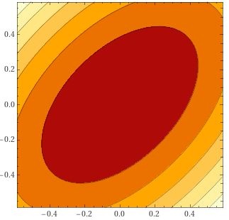

# 1. 概要
Fisherの線形判別分析は、一次式で表される判別関数でラベルを予測する手法でした。そこで今回は、Fisherの線形判別分析の拡張にあたる非線形判別分析を紹介します。この判別関数は二次式になっていて、Fisherの線形判別分析より複雑な決定境界を作ることができます。

**Remark** : 決定境界とは、ラベルの予測結果が変わる条件のことです。つまり、判別関数=0をみたす説明変数の値全体のことです。判別関数が一次式のとき、決定境界は散布図上で超平面（説明変数が2つなら直線・3つなら平面...）になります。


# 2. 非線形判別分析
## 2.1 データセットの準備
`R`言語にもともと備え付けられている`iris`データセットをデモに用いましょう。話を簡単にするため、事前に以下の処理を行っておいてください。

* 説明変数は `Petal.Length` と `Petal.Width` の2変数のみとする。
* 目的変数は `Species` とし、ラベルは `versicolor` と `virginica` の2種類のみを対象とする。

```{r}
# デモデータセットの作成
data(iris)    # irisデータの読み込み
dat <- iris[iris$Species %in% c("versicolor", "virginica"),
            c("Petal.Length", "Petal.Width", "Species")]
dat$Species <- factor(dat$Species, levels = c("versicolor", "virginica"))
head(dat, n = 5)
```

散布図をかいてデータの様子を確認しておきましょう。

```{r}
plot(dat, col = dat$Species)
```


## 2.2 課題設定
次の課題を考えます。

**課題** : `Petal.Length` と `Petal.Width` の値から `Species` が `versicolor` と `virginica` のどちらであるかを予測する式を作りましょう。


## 2.3 非線形判別分析
非線形判別分析によって、そのデータが`versicolor`と`virginica`のどちらなのかを予測するための判別関数を求めることができます。具体的にどう求めるのか、その考え方は第3章で説明します。ひとまず`R`言語を用いて判別関数を求めてみましょう。非線形判別分析は `MASS` パッケージの `qda` 関数によって計算することができます。

```{r}
library(MASS)
result <- qda(Species ~ Petal.Length + Petal.Width, data = dat)
result
```

`qda`関数からは残念ながら判別関数の情報を取得することができませんが、次のように予測を行うことはできます。`predict`関数を用いて判別関数を計算できるので、確認してみましょう。

```{r}
# R言語のpredict関数で計算した判別得点
pred <- predict(result, dat[1, c("Petal.Length", "Petal.Width")])
pred$class
```


# 3. 非線形判別分析の仕組み
## 3.1 基本的な考え方
非線形判別分析のアイディアは次の通りです。

**アイディア** : ラベルを予測したいデータ点が、ラベル $y=0$ の群に近いか？ラベル $y=1$ の群に近いか？

もし、ラベルを予測したいデータ点がラベル $y=0$ より $y=1$ の群に近いなら、ラベルを $y=1$ と予測しようというわけです。これは、もしデータ点 $x$ とラベル $y$ が与えられているデータ群 $G_{y}$ との間の距離 $d(x,G)$ が定義できるなら、判別関数を

$$
\begin{align*}
f(x) &= - d(x,G_{y=1}) + d(x,G_{y=0})
\end{align*}
$$

と定義することと同じです。そして判別関数 $f(x)$ の値が正ならラベルを $y=1$、負ならラベルを $y=0$ と予測しようというわけです。

では、データ点 $x$ とラベル $y$ が与えられているデータ群 $G_y$ との間の距離 $d(x,G_{y})$ をどのように定義すればよいでしょうか。非線形判別分析では**Mahalanobis距離**とよばれる距離が用いられています。

## 3.2 Mahalanobis距離
Mahalanobis距離は、1936年にインドの数理統計学者であるプラサンタ・チャンドラ・マハラノビスによって提案された距離です。次のような定義になっています。

**定義** : $x$ を興味のあるデータ点、$G$ をデータ群、$\bar{x}_{G}$ をデータ群 $G$ の標本平均、$\Sigma_{G}$ をデータ群 $G$ の分散共分散行列とします。このとき、
$$
\begin{align*}
d(x,G) &= (x-\bar{x}_G)^T\Sigma_G^{-1}(x-\bar{x}_G)
\end{align*}
$$
をMahalanobis距離といいます。

Mahalanobis距離のイメージを掴むために次の問題を解いてみましょう。

**問題** : 2変数のデータ$(x_1,x_2)$を考えます。群 $G$ の標本平均を $\bar{x}=(\bar{x_1},\bar{x_2})=(0,0)$、分散共分散行列を
$$
\begin{align*}
\Sigma &= \begin{pmatrix}1&0.5\\0.5&1\end{pmatrix}
\end{align*}
$$
とします。このとき、$(x_1,x_2)$ の散布図上にMahalanobis距離の等高線を描いでください。

**解答** : Mahalanobis距離を式で表すと、次のようになります。
$$
\begin{align*}
d(x,G) &= \begin{pmatrix}x_1-0&x_2-0\end{pmatrix}\begin{pmatrix}1&0.5\\0.5&1\end{pmatrix}^{-1}\begin{pmatrix}x_1-0\\x_2-0\end{pmatrix}\\
&= \frac{1}{0.75}\begin{pmatrix}x_1&x_2\end{pmatrix}\begin{pmatrix}1&-0.5\\-0.5&1\end{pmatrix}\begin{pmatrix}x_1\\x_2\end{pmatrix}\\
&= \frac{1}{0.75}(x_1^2-x_1x_2+x_2^2)
\end{align*}
$$
これより等高線は次のようになります。（以下の図はwolfram alphaでかいたものです。）

<center></center>

以上が問題の解答になります。■

つまりMahalanobis距離は、データ点 $x$ が群 $G$ の母集団からどれだけ発生しづらいデータかを見積もっているものだと解釈することができるでしょう。また、Mahalanobis距離は説明変数の2次式なので、その差をとる非線形判別分析の判別関数もまた一般には2次式になります。このため、非線形判別分析を二次判別分析ということもあります。

## 3.3 `qda`関数の結果の再現
`qda`関数による次の計算結果を再現してみましょう。

```{r}
# R言語のpredict関数で計算した判別得点
pred <- predict(result, dat[1, c("Petal.Length", "Petal.Width")])
pred$class
```

`versicolor`群と`viginica`群の標本平均、分散共分散行列を求めておきます。

```{r}
# versicolor群の標本平均と分散共分散行列
dat_versi <- dat[dat$Species == "versicolor", 
                 c("Petal.Length", "Petal.Width")]
xbar_versi <- apply(dat_versi, MARGIN = 2, FUN = mean)
cov_versi <- cov(dat_versi)
```

```{r}
# virginica群の標本平均と分散共分散行列
dat_virgi <- dat[dat$Species == "virginica", 
                 c("Petal.Length", "Petal.Width")]
xbar_virgi <- apply(dat_virgi, MARGIN = 2, FUN = mean)
cov_virgi <- cov(dat_virgi)
```

あとは、興味のあるデータ点について、`versicolor`群および`virginica`群とのMahalanobis距離を計算し、判別関数の値を計算します。

```{r}
x <- dat[1, c("Petal.Length", "Petal.Width")]
d_versi <- mahalanobis(x = x, center = xbar_versi, cov = cov_versi)
d_virgi <- mahalanobis(x = x, center = xbar_virgi, cov = cov_virgi)
- d_versi + d_virgi
```

今回、判別関数は正なので、ラベルを`versicolor`だと予測できます。このようにして`qda`関数の予測を再現することができました。

## 3.4 Fisherの線形判別分析との関連
やや難しい計算になるので詳細は省きますが、Fisherの線形判別分析もこのMahalanobis距離を用いた手法だと解釈できることが知られています。Fisherの線形判別分析では、群 $G_{y=1}$, $G_{y=0}$ の分散共分散行列が母集団では等しいという仮定を入れます。つまり、分散共分散行列の推定量にはpoolされた分散 $S_W$ を用いるわけです。これは、Fisherの線形判別分析でいうところの群内分散そのものです。

さてこの場合、Mahalanobis距離を用いた判別関数は
$$
\begin{align*}
f(x) &= - d(x,G_{y=1}) + d(x,G_{y=0})\\
&= - (x-\bar{x}_{y=1})^TS_W^{-1}(x-\bar{x}_{y=1}) + (x-\bar{x}_{y=0})^TS_W^{-1}(x-\bar{x}_{y=0})\\
&= 2(\bar{x}_{y=1}-\bar{x}_{y=0})^TS_W^{-1}x + (-\bar{x}_{y=1}^TS_W^{-1}\bar{x}_{y=1}+\bar{x}_{y=0}^TS_W^{-1}\bar{x}_{y=0})
\end{align*}
$$
です。実は、この判別関数はFisherの線形判別分析から得られる判別関数に等しくなることが証明できます。実際、デモデータで一次式の係数 $(\bar{x}_{y=1}-\bar{x}_{y=0})^TS_W^{-1}$ を計算すると、次のようになります。

```{r}
Sm <- cov(dat[dat$Species == "versicolor", c("Petal.Length", "Petal.Width")])
Sp <- cov(dat[dat$Species == "virginica", c("Petal.Length", "Petal.Width")])
SW <- 1/(100-2) * ((50-1)*Sm + (50-1)*Sp)
coef <- t(xbar_versi - xbar_virgi) %*% solve(SW)
coef
```
これは、`lda`関数によって計算される判別関数の一次式の係数に比例（-3.17倍）していることが次のようにして確認できます。

```{r}
result <- lda(Species ~ Petal.Length + Petal.Width, data = dat)
coef / as.vector(result$scaling)
```


