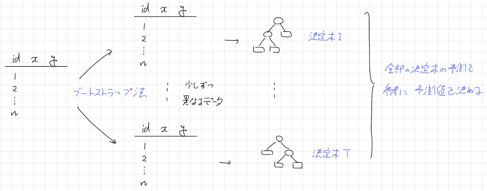

# 1. バギング・ランダムフォレストの概要
**バギング**（bagging）とは、ブートストラップサンプリングとよばれる方法でデータを複数回複製し、複製したデータたちで作った決定木たちによって予測を決定する方法です。次の図が参考になるでしょう。

<center></center>

今回はバギング、またバギングに修正を加えた**ランダムフォレスト**（random forest）を紹介します。

**Remark** : 実際にはバギングは決定木以外の手法を使うこともありますが、決定木を用いたほうがバギングという手法が効果的であるため、一般に決定木が用いられています。■


# 2. ランダムフォレストのデモ
## 2.1 デモデータ
`data`ディレクトリの`split_demo.csv`をデモデータに用います。このデータは、標本サイズが100で3変数のデータです。今回は、`x`, `y`を説明変数、`label`を目的変数としたランダムフォレスト分類を行ってみます。

```{r}
dat <- read.csv("./data/split_demo.csv", fileEncoding = "utf-8")
dat$label <- as.factor(dat$label)
head(x = dat, n = 5)
```

`label`別に色分けした散布図をかいて、標本点の分布を確認しておきましょう。

```{r}
plot(dat$x, dat$y, col = dat$label)
```

**問題** : この散布図から、変数 $x$ と変数 $y$ のどちらがよりラベルの予測に貢献するか、また特にその差はないかを想定してください。

## 2.2 ランダムフォレスト分類の計算
ランダムフォレスト分類は`ranger`パッケージの`ranger`関数で計算することができます。指定する引数は以下のとおりです。

* `formula` : 目的変数と説明変数を指定する。
* `data` : 決定木を作るために用いるデータ。
* `classification` : 回帰か分類か。目的変数を`factor`型にcastしているときは、指定しなくても分類になる。
* `importance` : 変数重要度の計算方法
* `write.forest` : あとで予測を行う場合は`TRUE`にする。
* `num.trees` : 木の数
* `mtry` : 各ノードで分割条件を探す変数の個数
* `max.depth` : ここに渡した数より深い決定木は作らない。
* `min.node.size` : ここに渡した数より所属する標本点の個数が少ないノードでは、これ以上分割を試みない。

このうち、本質的に重要なのは`num.trees`、`mtry`、`max.depth`、`min.node.size`です。`max.depth`と`min.node.size`が作る決定木の複雑度を決めるハイパーパラメータです。`num.trees`は3.2節で、`mtry`は3.4節で解説します。


```{r}
library(ranger)
result <- ranger(formula = label ~ x + y, 
                 data = dat, 
                 classification = TRUE,    # 今回はなくてよい。
                 importance = "impurity", 
                 write.forest = TRUE,
                 num.trees = 100,
                 mtry = 1, 
                 max.depth = 2, 
                 min.node.size = 20)
result
```


## 2.3 変数重要度
各説明変数が目的変数の予測にどれだけ寄与したのかを数値を用いて表現する方法に**変数重要度**（variable importance）があります。詳しくは3.4節で説明しますが、ひとまず値を参照する方法を紹介します。

```{r}
result$variable.importance
```

**問題** : 前回計算した決定木の変数重要度と比較して、どちらのほうが想定に近いかを確認してみましょう。


# 3. ランダムフォレスト分類の仕組み
## 3.1 決定木分析の不安定性
決定木分析の不安定性という性質を説明するために、実験をしてみましょう。以下のような確率分布 $D$ からラベルAが $50$ 個、ラベルBが $50$ 個含まれる標本をとり、このラベルを予測する決定木を求めます。これを繰り返し行ったとき、得られる決定木にあまり変化がないか、それとも大きく異なるかに注目してみてください。

確率分布 $D$ は次のとおりです。このスクリプトの内容を理解できる必要はありませんが、興味のある方はフォローしてみてください。

```{r}
# 確率分布Dからの標本抽出
library(MASS)
library(ggplot2)
sample_demo <- function(){
  A1 <- mvrnorm(n = 25, mu = c(1, 1), Sigma = 0.25*diag(2))
  A2 <- mvrnorm(n = 25, mu = c(-1, -1), Sigma = 0.25*diag(2))
  A3 <- mvrnorm(n = 25, mu = c(-1, 1), Sigma = 0.25*diag(2))
  B1 <- mvrnorm(n = 25, mu = c(1, -1), Sigma = 0.25*diag(2))
  X <- rbind(A1, A2, A3, B1)
  label <- rep(c(1, 2), c(75, 25))

  dat <- data.frame(x = X[, 1], y = X[, 2], label = label)
  return(dat)
}

dat <- sample_demo()
dat$label <- as.factor(dat$label)
qplot(x = x, y = y, color = label, data = dat, geom = "point")
```

それでは、実験してみましょう。以下のスクリプトを繰り返し実行して、得られる決定木が各回ごとに異なるかを確認してみましょう。

```{r}
# 実験
library(rpart)
library(partykit)
dat <- sample_demo()    # 標本抽出
dat$label <- as.factor(dat$label)
result <- rpart(formula = label ~ x + y,    # 決定木の計算
                data = dat, 
                method = "class", 
                control = rpart.control(maxdepth = 3, 
                                        minsplit = 10, 
                                        minbucket = 3))
plot(as.party(result))    # 得られた決定木の可視化
```

**問題** : この実験からわかる決定木分析の性質を言葉で説明してみましょう。

**解答** : 決定木分析は母集団から得られる標本によって、計算される決定木が大きく変化しうる。この性質を**決定木分析の不安定性**（instability）という。■


## 3.2 バギングとブートストラップサンプリング
決定木分析には2つの欠点が知られています。
* 十分な予測精度が得られづらい。
* 決定木分析の不安定性により、変数重要度もまた不安定になる。

決定木分析の不安定性を逆手にとり、元のデータとは少し異なるデータを複数回複製し、複製したデータたちで作った決定木たちによって予測を決定することで、
* 決定木分析の予測精度を向上できる
* 変数重要度の結果が安定する

のではないかと考えたのがバギングです。ここで、データを複製する方法として**ブートストラップサンプリング**が用いられます。

ブートストラップサンプリングとは、データからデータ点を復元抽出する方法のことです。例えば、次のような操作をやっていることになります。得られる標本をブートストラップ標本といいます。`ranger`関数では、`num.trees` 引数で作るブートストラップ標本の数を指定できます。`num.trees`は大きい値を設定するほど一般に予測精度が改善します。ただし、

* `num.trees`に十分に大きい値を渡した場合、それ以上大きくしても予測精度の改善は飽和する。
* `num.trees`が大きい値になると、それだけ決定木を作らないといけないので、計算に時間がかかる。

という2点に気をつけてください。この点を踏まえて、大きすぎない`num.trees`を設定すると良いでしょう。


```{r}
# デモデータ
demo <- data.frame(x = 2*(1:5), y = 3*(1:5))
demo
```

```{r}
# demoのブートストラップ標本
idx_sample <- sample(x = 1:5, size = 5, replace = TRUE)
demo_bootstrap <- demo[idx_sample, ]
demo_bootstrap
```

## 3.3 バギングの予測と変数重要度の計算
バギングではラベルの予測を作った決定木たちの多数決によって決めます。なお回帰の場合は、多数決のかわりに平均値を用います。また、変数重要度は作った決定木たちの変数重要度の平均値を計算します。


## 3.4 バギングとランダムフォレストの違い
2001年にL. Breimanは、ブートストラップ標本から得られる決定木の類似性をより小さくする工夫をすれば、予測精度をより向上させられるのではないかと考え、ランダムフォレストを提案しました。このアイディアは、次のような数式でよく説明されます。

$X_1,\cdots,X_B$ を期待値が $\mu$、分散が $\sigma^2$ の確率変数とします。またこの標本平均を $\bar{X}$ と表すこととします。確率変数 $X_i$ と $X_j$ の間に正の相関 $\rho$ がある場合、

$$
\begin{align*}
\mathbb{V}\left[\bar{X}\right] &= \frac{1}{B^2}\mathbb{V}\left[\sum_{b=1}^{B}X_b\right]\\
&= \frac{1}{B^2}\left(\sum_{b=1}^{B}\mathbb{V}[X_i]+\sum_{b\neq b'}Cov(X_b,X_{b'})\right)\\
&= \frac{1}{B^2}\left(B\sigma^2+B(B-1)\rho\sigma^2\right)\\
&= \frac{1}{B}\sigma^2 + \frac{B-1}{B}\rho\sigma^2\\
&= \frac{1}{B}\left(1+(B-1)\rho\right)\sigma^2
\end{align*}
$$
が成り立ちます。$B$ をブートストラップ標本の数、$\bar{X}$ を予測値、$\rho$ を決定木の予測値の相関係数だと考えてみましょう。すると、

* ブートストラップ標本の数を増やすほど $B$ が大きくなり予測値の分散が小さくなる。
* 作る決定木たちの予測値の相関を小さくするほど予測値の分散が小さくなる。

ことがわかります。$B$ を大きくするというアイディアはバギングで実現できています。一方で、作る決定木たちの予測値の相関を小さくするというアイディアは、バギングでは達成できていないと考えたわけです。

そこでBreimanは、決定木を計算するときに各ノードに現れる説明変数の候補をランダムに選択するという**特徴量のバギング**とよばれるアイディアを導入しました。また、これを取り入れた手法をランダムフォレストとして提案しました。`ranger`関数では、`mtry`引数がこれに対応します。

**Remark** : なお、random forestを提案した4年後の2005年にLeo Breimanは亡くなってしまいました。random forestを提案したとき、Breimanはすでに73歳でした。■


