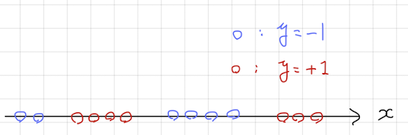
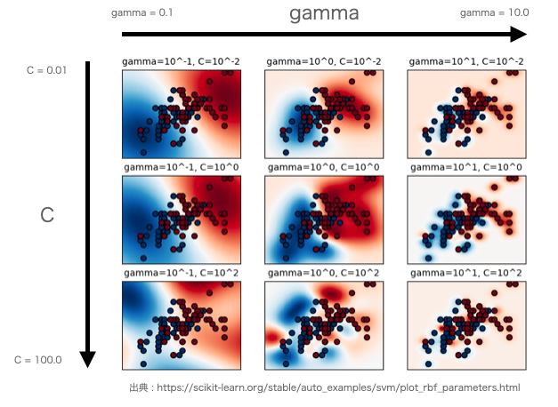

# 1. 概要
サポートベクトルマシン（support vector machine）は、ある変数を他の変数から予測する式を作る手法の一つです。目的変数が量的変数の場合に用いるサポートベクトル回帰と目的変数が質的変数のときに用いるサポートベクトル分類があります。今回は、特に2種類のラベルを目的変数としたサポートベクトル分類に絞って解説します。


# 2. サポートベクトル分類のデモ
# 2.1 デモデータ
`data` ディレクトリの `xor_demo_train.csv` をデモデータに用います。このデータは、標本サイズが300で3変数のデータです。`x1` と `x2` は量的変数、`y` は `1` と `2` からなる2値の質的変数です。今回は、`x1`, `x2` を説明変数、`y` を目的変数としたサポートベクトル分類を行ってみます。

```{r}
train <- read.csv("./data/xor_demo_train.csv", 
                  fileEncoding = "utf-8")
train$y <- as.factor(train$y)
head(x = train, n = 5)
```

`y` の値に応じて色分けした散布図をかいて、分布の様子を確認しておきましょう。

```{r}
plot(train$x1, train$x2, col = train$y)
```

**問題** : 2値の質的変数からなる目的変数 `y` を説明変数 `x` を用いて予測するとき、予測が切り替わる境界線を**決定境界**（decision boundary）といいます。今回のデータに対して適切な決定境界を事前に想定しておきましょう。


## 2.2 前処理
サポートベクトルマシンは、大きなスケールを持つ変数があると、その変数によって予測を決めてしまう傾向にあります。そのため、予め変数を正規化することが一般的です。今回は例として、min-max正規化を施します。

```{r}
summary(train)
```

```{r}
x1_min <- min(train$x1)
x1_max <- max(train$x1)
x2_min <- min(train$x2)
x2_max <- max(train$x2)
```


```{r}
# min-max正規化
x1 <- (train$x1 - x1_min) / (x1_max - x1_min)
x2 <- (train$x2 - x2_min) / (x2_max - x2_min)
train_scaled <- data.frame(x1 = x1, x2 = x2, y = train$y)
head(train_scaled, n = 5)
```


## 2.3 サポートベクトル分類の計算
サポートベクトル分類は `kernlab` パッケージの `ksvm` 関数で計算することが出来ます。指定する引数は以下のとおりです。

* `x` : 目的変数と説明変数を指定する。
* `data` : サポートベクトル分類を作るために用いるデータ。
* `type` : 回帰か分類か。分類には二通りあり、`C_svc` と `nu-svc` があるが、今回は `C-svc` を指定する。
* `C` : 決定境界の複雑度をコントロールするハイパーパラメータの一つです。
* `kernel` : 標本点の類似度を計算する関数（カーネル関数）を指定する。バニラカーネルとよばれる`vanilladot`、多項式カーネルとよばれる`polydot`、RBFカーネルとよばれる`rbfdot`などがある。今回は`rbfdot`を指定する。
* `kpar` : `kernel`で指定したカーネル関数ごとに計算される決定氷塊の複雑度をコントロールするハイパーパラメータがある。RBFカーネル `rbfdot` の場合、`sigma` を指定する。

わからない単語もあると思いますが、3節で詳しく解説します。

```{r}
library(kernlab)
result <- ksvm(x = y ~ x1 + x2, 
               data = train_scaled,    # 正規化したデータ
               type = "C-svc", 
               C = 1.0,
               kernel = "rbfdot", 
               kpar = list(sigma = 1.0))
result
```

## 2.4 決定境界の確認
サポートベクトル分類で得られる決定境界の式は複雑なので、数式を確認する代わりに散布図上に図示しましょう。

```{r}
# メッシュグリッドの作成
xx1 <- seq(-3, 3, 0.05)
xx2 <- seq(-3, 3, 0.05)
meshgrid <- expand.grid(xx1, xx2)
names(meshgrid) <- c("x1", "x2")
head(meshgrid, n = 5)
```

```{r}
# メッシュグリッドデータの正規化
x1 <- (meshgrid$x1 - x1_min) / (x1_max - x1_min)
x2 <- (meshgrid$x2 - x2_min) / (x2_max - x2_min)
meshgrid_scaled <- data.frame(x1 = x1, x2 = x2)
head(meshgrid_scaled, n = 5)
```

```{r}
# 決定関数の計算
pred <- predict(result, meshgrid_scaled, type = "decision")
contour(xx1, xx2, 
        array(pred, dim = c(length(xx1), length(xx2))))
```

**問題** : `C` や `gamma` を動かして、決定関数の等高線をかいてみましょう。


## 2.5 予測精度の確認と過剰適合・過少適合
RBFカーネルのサポートベクトル分類のように、ハイパーパラメータを調整することで、とても複雑な決定関数を計算できる場合、決定関数を求めるために用いたデータで精度を確認しても、未知のデータに対する予測精度とは大きく結果が乖離してしまうことがあります。このような現象を**過剰適合**（overfit）といいます。逆に単純すぎる決定関数を計算してしまった場合を**過少適合**（underfit）といいます。

**問題** : 線形回帰や決定木分析などでも過剰適合・過少適合が起こります。どのようなケースかを考えてみてください。

このため、一般に予測の精度を確認するためには、モデルの作成には用いないデータを別に準備しておき、このデータで予測精度を確認することが一般的です。これを**ホールドアウト法**（hold-out method）といいます。モデルの作成に用いるデータを**訓練データ**、モデルの予測精度の検討に使うデータを**テストデータ**といいます。

今回はホールドアウト法のために、`xor_demo_test.csv` を準備しました。

```{r}
# テストデータの読み込み
test <- read.csv("./data/xor_demo_test.csv", 
                  fileEncoding = "utf-8")
test$y <- as.factor(test$y)
head(x = test, n = 5)
```

テストデータにも訓練データと同様の前処理を行っておきます。

```{r}
# min-max正規化
x1 <- (test$x1 - x1_min) / (x1_max - x1_min)
x2 <- (test$x2 - x2_min) / (x2_max - x2_min)
test_scaled <- data.frame(x1 = x1, x2 = x2, y = test$y)
head(test_scaled, n = 5)
```

では、テストデータに対する予測を行い、精度を評価してみましょう。ラベルの予測の精度を評価するうえでは、正解と予測のクロス集計表をかくのが便利でしょう。これを**混同行列**（confusion matrix）といいます。

```{r}
# テストデータでの混同行列
pred_test <- predict(result, test_scaled, type = "response")
table(test$y, pred_test)
```

参考のため訓練データでの混同行列も計算しておきましょう。
```{r}
# 訓練データでの混同行列
pred_train <- predict(result, train_scaled, type = "response")
table(train$y, pred_train)
```

**問題** : ハイパーパラメータ `C` や `gamma` を大きくしたり、小さくしたりして、訓練データとテストデータの混同行列がどう変化するかを観察してみてください。


# 3. サポートベクトル分類の仕組み
## 3.1 カーネル関数
標本点の間の類似度を測る方法にカーネル関数があります。2つの標本点 $x$, $x'$ に対してカーネル関数を $k(x,x')$ とおくと、類似度を $\displaystyle\frac{k(x,x')}{\sqrt{k(x,x)}\sqrt{k(x',x')}}$ で与えます。なお、どんな標本点 $x$ にも $k(x,x)=1$ がなりたつようなカーネル関数を正規化カーネル関数といいます。

カーネル関数の厳密な定義を紹介するかわりに、よく用いられるカーネル関数の例を紹介します。

* バニラカーネル : $k(x,x') = x^Tx'$
* 多項式カーネル : $k(x,x') = (1+x^Tx')^d$
* RBFカーネル : $k(x,x') = \exp\left(-\frac{\|x-x'\|^2}{2\sigma^2}\right)$

**問題** : RBFカーネルについて以下の問いに答えてください。

1. RBFカーネルが正規化カーネル関数であることを示してください。
2. $x=(1,1)$, $x'=(1,1)$ および $x=(1,1)$, $x'=(1,2)$の場合にRBFカーネルによる類似度を計算してください。
3. RBFカーネルが0以上1以下の値しか取れないことを示してください。

カーネル関数では、3.2節で述べるようにカーネル関数による標本点の間の類似度を目的変数 $y$ の予測に用います。`R`言語の `ksvm` 関数の場合は `type` 引数に `vaniladot`、`polydot`、`rbfdot`などと指定します。


## 3.2 カーネルサポートベクトル分類の決定関数
カーネルサポートベクトル分類では、次のような決定関数を考えます。なお、目的変数 $y$ は $\pm1$ のいずれかの値を取るものと定めます。

$$
\begin{align*}
f(x) &= \sum_{i}\beta_iy_ik(x_i,x) + b
\end{align*}
$$
そして、$f(x)$ が正だった場合には目的変数の予測値を $+1$、負だった場合には目的変数の予測値を $-1$ とします。$\beta\geq0$, $b$ がそれぞれ決定関数のパラメータで、これを訓練データから求めます。なお、

* $\beta_i$ は必ず $0$ 以上の値になる。
* カーネル関数 $k(x,x')$ は必ず $0$ 以上の値をとる。

が成り立ちます。ゆえに、興味のある標本点が $\beta_i$ の値が大きい標本点と高い類似度をもつとき、目的変数 $y$ の予測はその標本点の目的変数の値になりやすいことが、決定関数の形から確認できます。

**Remark** : パラメータ $\beta$, $b$ の求め方は難しいので、ここでは省略します。興味のある方は講座「カーネル法入門」を参考にしてみてください。■

**問題** : 多項式カーネルを用いたサポートベクトル分類器によって、以下のようなデータのラベル $y$ を予測できる決定関数を作りたい。このとき、多項式カーネルの次数ハイパーパラメータ $d$ をいくらにすることが適切であろうか。

<center></center>


なお、RBFカーネルを用いたサポートベクトルマシンには次のような性質があることが知られています。この図から $\gamma = 1/(2\sigma^2)$ の設定によって決定境界がどのように変化するかを考察しておきましょう。

<center></center>

### $\gamma$ が小さい場合
$\gamma$ が小さい値のときを考えてみましょう。この場合、Taylor展開を用いることで決定関数を

$$
\begin{align*}
f(x;w,b) &\sim \sum_{i:\beta_i>0}\beta_iy_i(1-\gamma\|x_i-x\|^2)+b\\
&= -\sum_{i:\beta_i>0}\beta_iy_i\gamma\|x_i-x\|^2+b
\end{align*}
$$

と近似できます。このことから、目的変数の予測は最も近いデータ点 $x_i$, $\beta_i>0$ の目的変数の値 $y_i$ によって決まる線形な境界に近くなることがわかります。

### $\gamma$ が大きい場合
$\gamma$ の値が大きくなると、$\beta_i\neq0$ をみたすようなデータ点 $x_i$ の周辺に球状の決定境界を作る傾向があることがみてとれます。


## 3.3 ハイパーパラメータ $C$ の影響
実は、パラメータ $\beta$ は、

$$
\begin{align*}
0\leq\beta_i\leq C
\end{align*}
$$
をみたすように計算されます。このことから、$C$ を調整することで、訓練データの標本点が予測に与える影響度を制御することができます。


