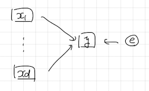

# 1. 概要と例題
各変数間の複雑な関係を**パス図**とよばれる図で表しておき、変数間の関係の強さを表す**パス係数**を分散共分散行列をヒントに求める手法を**共分散構造分析**といいます。今回は、

* パス図とはなにか？
* パス係数とはなにか？共分散構造分析では、どうやって求めるのか？
* 得られた結果の読み方

を知るために、次の例題を考えてみましょう。


**例題**　S大学のデータサイエンス学部では、1年次に「初級統計学」「基礎からのR」、2年次に「続初級統計学」「数理統計学」の講義を開講しています。I教授は、期末試験の結果を用いて、この4科目の理解度の関係を説明できるようなモデルを作ろうと考えました。以下の問に答えてください。

[1]　I教授は以下のような仮説を立てました。この仮説をもとにパス図をかいてください。

1. 「初級統計学」と「基礎からのR」の間には相関関係がある。
2. 2年次の講義の理解度はいずれも、1年次の講義の理解度によって変化する。

[2]　[1]のパス図が与える構造方程式を述べてください。また構造方程式のパラメータ（外生変数の分散、パス係数と誤差の分散）をすべて挙げてください。

[3]　[2]の構造方程式が定める「初級統計学」「基礎からのR」「続初級統計学」「数理統計学」の分散共分散行列を求めてください。

[4]　共分散構造分析には、構造方程式のパラメータ（外生変数の分散、パス係数と誤差の分散）を求める代表的な方法に、最尤法と最小二乗法の2通りがあります。このうち、最小二乗法とはどのような計算を行うものかを説明してください。

[5]　R言語では`lavaan`パッケージの`sem`関数を用いて[4]の計算を行うことができます。今回、25名の学生について4科目の成績を`data`ディレクトリに`seiseki.csv`という名前のcsvファイルに記録しました。このファイルと`sem`関数を用いて構造方程式のパラメータを推定してください。

[6]　次の空欄に当てはまる数値を答えてください：「数理統計学」は「初級統計学」と「基礎からのR」から（ア）だけ説明することができる。「初級統計学」が1点高い生徒は、「数理統計学」が（イ）点高くなる傾向にある。


# 2. パス図
パス図は以下の2つを組み合わせて作る変数間の関係を表す図のことです。

(1) 2変数 $x$ と $y$ の相関関係を想定する場合。
<center></center>

(2) 変数 $y$ を変数 $x_1,\cdots,x_d$ によって説明する式

$$
\begin{align*}
y &= w_0 + w_1x_1 + \cdots + w_dx_D + e
\end{align*}
$$

を想定する場合。ここで、$e$ は変数 $x_1,\cdots,x_d$ では説明できなかった変数 $y$ の**誤差**を表すとします。
<center></center>

例題の[1]の解答は次のようになります。

<center></center>

**Remark**　共分散構造分析では、逐次モデルとよばれるパス図のみを対象にします。逐次モデルとはcycleが含まれないようなパス図のことです。
<center></center>

# 3. 構造方程式とそのパラメータ
パス図が与える構造方程式とは、パス図で表現した変数間の関係を数式で表したもののことです。「初級統計学」を$x_1$、「基礎からのR」を$x_2$、「続初級統計学」を$x_3$、「数理統計学」を$x_4$と表すことにして、例題の[2]の解答を与えます。

$$
\begin{align*}
x_3 &= w_{30} + w_{31}x_1 + w_{32}x_2 + e_{3}\\
x_4 &= w_{41} + w_{41}x_1 + w_{42}x_2 + e_{4}
\end{align*}
$$
ただし$x_1$と$x_2$の分散をそれぞれ$\sigma_1^2$, $\sigma_2^2$、$x_1$と$x_2$の共分散を$Cov(x_1,x_2)=\sigma_{12}$、誤差$e_3$と$e_4$をそれぞれ期待値が$0$かつ分散が$\sigma_3^2$, $\sigma_4^2$とします。

このうち、構造方程式のパラメータは$w_{31},w_{32},w_{41},w_{42},\sigma_{12},\sigma_1^2,\sigma_2^2,\sigma_3^2,\sigma_4^2$の9個（切片$w_{30}$, $w_{40}$が含まれないことに注意）で、

* 外生変数の分散 : $\sigma_1^2,\sigma_2^2$
* パス係数：$w_{31},w_{32},w_{41},w_{42},\sigma_{12}$
* 誤差の分散 : $\sigma_3^2,\sigma_4^2$

といいます。

なんらかの変数によって回帰されている変数を**内生変数**、どの変数からも回帰されていない変数のことを**外生変数**といいます。以下のパス図の各変数を内生変数と外生変数に分類してみましょう。

<center></center>


# 4. 構造方程式が定める分散共分散行列
例題の[2]で解答した構造方程式から、4科目の分散共分散行列は構造方程式のパラメータ（外生変数の分散、パス係数と誤差の分散）を用いて次のように表すことができます。なお、下三角は省略しました。

$$
\begin{align*}
\begin{pmatrix}
\sigma_1^2 & c & w_{31}\sigma_1^2+w_{32}c & w_{41}\sigma_1^2+w_{42}c\\
& \sigma_2^2 & w_{31}c+w_{32}\sigma_2^2 & w_{41}c+w_{42}\sigma_2^2\\
& & w_{31}^2\sigma_1^2+2w_{31}w_{32}c+w_{32}^2\sigma_2^2+\sigma_3^2 & w_{31}w_{41}\sigma_1^2+(w_{31}w_{42}+w_{41}w_{32})c+w_{32}w_{42}\sigma_2^2\\
& & & w_{41}^2\sigma_1^2+2w_{41}w_{42}c+w_{42}^2\sigma_2^2+\sigma_4^2
\end{pmatrix}
\end{align*}
$$

# 5. 共分散構造分析の最小2乗法
共分散構造分析には、構造方程式のパラメータ（外生変数の分散、パス係数と誤差の分散）を推定する方法の代表例として、最尤法と最小二乗法があります。最小二乗法では、

* データ（標本）の分散共分散行列 $S$
* 構造方程式から求まる分散共分散行列 $\Sigma$

の各要素の差の2乗和 $\displaystyle\sum_{i\geq j}(\Sigma_{ij}-S_{ij})^2$ が最小になるように構造方程式のパラメータを求めます。

# 6. R言語を用いた共分散構造分析の計算
## 6.1 `lavaan`パッケージのインストール
R言語で共分散構造分析を計算するためのパッケージには、`lavaan`と`sem`が有名ですが、今回は`lavaan`を用いていきましょう。また、`lavaan`の結果を確認するために、`semPlot`パッケージを用います。`lavaan`パッケージと`semPlot`パッケージをインストールし、読み込んでおいてください。

```{r}
# パッケージのインストールと読み込み
# install.packages("lavaan")
# install.packages("semPlot")
library(lavaan)
library(semPlot)
```

## 6.2 データの読み込み
今回、学生の4科目の成績を`seiseki.csv`という名前のcsvファイルに記録しました。このファイルを読み込んで、先頭5行を確認してみましょう。

```{r}
# データの読み込み
dat <- read.csv("./data/seiseki.csv", fileEncoding = "utf-8")
head(dat, n = 5)
```

データの分散共分散行列も確認しておきましょう。

```{r}
# データの分散共分散行列
cov(dat)
```


## 6.3 構造方程式のコーディング
`sem`関数には構造方程式を渡す必要があります。相関関係は `~~`、回帰の関係は `~`を用いて表します。今回の構造方程式は次のようにコーディングできます。

```{r}
model <- "
  # 変数間の相関関係
  初級統計学 ~~ 基礎からのR
  続初級統計学 ~~ 0*数理統計学    # 相関がないことを明示する。
  
  # 構造方程式
  続初級統計学 ~ 初級統計学 + 基礎からのR
  数理統計学 ~ 初級統計学 + 基礎からのR
"
```

## 6.4 構造方程式のパラメータの推定
`sem`関数にデータ`dat`と構造方程式のコード`model`を渡すと、構造方程式のパラメータが計算できます。なお、`sem`関数では最尤法を用いています。

```{r}
result <- sem(model = model, data = dat)
summary(result, rsquare = TRUE)
```

```{r}
par(family = "ヒラギノ角ゴシック W3")
semPaths(result, "model", "est", sizeMan = 5, edge.label.cex = 1.0)
```

例題の[5]の解答は次のようになります。

* 外生変数の分散 : $\sigma_1^2=40.234$, $\sigma_2^2=16.00$
* パス係数 : $w_{31}=0.286$, $w_{32}=0.675$, $w_{41}=0.943$, $w_{42}=-0.152$, $\sigma_{12}=5.184$
* 誤差の分散 : $\sigma_3^2=85.023$, $\sigma_4^2=14.888$


# 7. 共分散構造分析の推定結果の解釈
例題の[6]に答える形で、共分散構造分析の推定結果の解釈を与えます。

## 7.1 決定係数
空欄（ア）についてです。（ア）は、

$$
\begin{align*}
\text{続初級統計学} &= w_{30} + w_{31}\times\text{初級統計学} + w_{32}\times\text{基礎からのR} + e_{3}
\end{align*}
$$
の決定係数を聞かれています。第6節の結果から、この回帰式の決定係数は $0.129$ だとわかります。この値を、決定係数の定義から直接計算してみましょう。決定係数の定義は 
$$
\text{決定係数} = 1-\frac{\text{誤差の分散}}{\text{続初級統計学の分散}}
$$
です。回帰式の誤差の分散は $\sigma_3^2=85.023$ と推定されています。一方で、続初級統計学の分散は

$$
\begin{align*}
\mathbb{V}[\text{続初級統計学}]
&= w_{31}^2\sigma_1^2+w_{32}^2\sigma_2^2+2w_{31}w_{32}\sigma_{12}+\sigma_3^2
\end{align*}
$$
です。Rを用いて値を求めてみましょう。

```{r}
0.286^2*40.234 + 0.675^2*16.00 + 2*0.286*0.675*5.184 + 85.023
```

あとは、決定係数の定義から次のようにして計算できます。

```{r}
1 - 85.023 / 97.60552
```

## 7.2 パス係数の解釈
空欄の（イ）に入るのは、パス係数 $w_{31}$ の推定値、つまり $0.286$ です。

