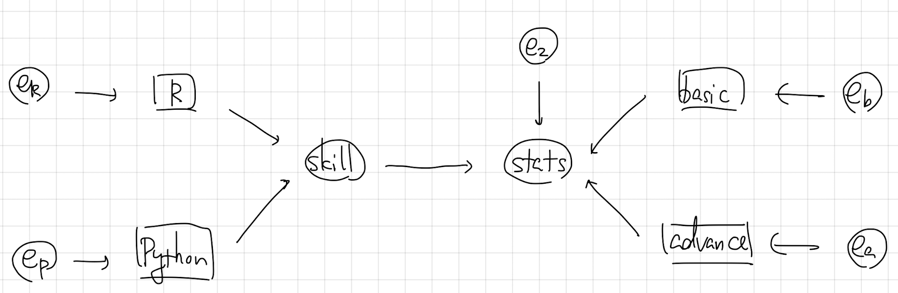

# 1. 概要と例題
今回は共分散構造分析のワンポイントアドバイスや注意点を紹介します。

1. 共分散構造分析に現れる変数は必ずしもデータに記録されている変数（観測変数）だけとは限りません。探索的因子分析に現れる共通因子のように、観測変数の共通性を意味する変数を作ることができます。これを**潜在変数**といいます。そこで、潜在変数を含む共分散構造分析のやり方を紹介します。

2. どんな構造方程式に対しても共分散構造分析の結果が得られるとは限りません。パラメータが推定可能かを調べる一つの方法である**自由度**を紹介します。

3. 共分散構造分析によって得られたモデルがどれだけデータに当てはまっているかを調べる方法として**適合度指標**を紹介します。


**例題**　S大学のデータサイエンス学部では、プログラミング言語系の講義として「基礎からのR」「基礎からのPython」、統計学の講義として「初級統計学」「続初級統計学」が開講されています。I教授はプログラミングのスキルが統計学の理解度にどれだけ影響があるのかを調べようと考えています。以下の問に答えてください。

[1]　データに観測されている変数を**観測変数**、観測されていない変数を**潜在変数**といいます。潜在変数「プログラミングのスキル」「統計学の理解度」および観測変数「基礎からのR」「基礎からのPython」「初級統計学」「続初級統計学」の間の関係を表すパス図を示してください。

[2]　潜在変数「プログラミングのスキル」「統計学の理解度」を定義する測定方程式と、これらの関係を示す構造方程式を述べてください。また測定方程式と構造方程式のパラメータ（外生変数の分散、パス係数と誤差の分散）をすべて挙げてください。

[3]　このモデルの自由度を述べよ。

[4]　今回、25名の学生について4科目の成績を`data`ディレクトリに`skill_stats.csv`という名前のcsvファイルに記録しました。このファイルとR言語の`lavaan`パッケージにある`sem`関数を用いて測定方程式と構造方程式のパラメータを推定してください。

[5]　モデルがデータにどれだけあてはまっているかを確認する方法に、**適合度指標**があります。適合度指標の例にGFIがあります。GFIの最小二乗法の場合の計算方法を説明してください。


# 2. 潜在変数を含む場合のパス図
潜在変数はパス図では、丸印で記されます。また潜在変数はデータに記録されていないので、観測変数を説明する関係を定義することで測定します。例題の[1]の場合は、次のような解答になります。

<center></center>

# 3. 測定方程式
潜在変数が観測変数を説明する式を**測定方程式**といいます。例えば「プログラミングのスキル」（以下、skillと略）という潜在変数は2つの観測変数「基礎からのR」（以下、Rと略）と「基礎からのPython」（以下、Pythonと略）に対して、

$$
\begin{align*}
\text{R} &= w_{R0}+w_{R1}\times\text{skill}+e_R\\
\text{Python} &= w_{P0}+w_{P1}\times\text{skill}+e_P
\end{align*}
$$
という方程式を測定方程式として準備します。ここで注意してほしいのは、このままだと潜在変数skillの平均と分散が一意に決まらないことです。そこで、一般的には潜在変数の平均を$0$とします。また分散を決めるために、$w_{r1}$か$w_{p1}$のいずれかの係数を$1$に固定します。

以上の議論から、測定方程式は次のようになります。なお、以下では「統計学の理解度」をstats、「初級統計学」をbasic、「続初級統計学」をadvanceと略すことにします。

$$
\begin{align*}
\text{R} &= w_{R0}+\text{skill}+e_{R}\\
\text{Python} &= w_{P0}+w_{P1}\times\text{skill}+e_P\\
\text{basic} &= w_{b0}\times\text{stats}+e_b\\
\text{advance} &= w_{a0}+w_{a1}\times\text{stats}+e_a
\end{align*}
$$
なお、誤差$e_{R}$の分散を$\sigma_{R}^2$と表すことにし、その他の誤差の分散も同様の記号を用いることにします。またskillの分散を$\sigma_{1}^2$とします。構造方程式は、

$$
\begin{align*}
\text{stats} &= w_{21}\times\text{skill}+e_{2}
\end{align*}
$$
です。なお、誤差$e_{s}$の分散を$\sigma_2^2$と表すことにします。切片項がないのは潜在変数の平均も誤差の平均も$0$と仮定することから、切片項が必ず$0$になることが従うためです。

また、測定方程式と構造方程式のパラメータは

* パス係数 : $w_{P1}$, $w_{a1}$, $w_{21}$
* 誤差の分散 : $\sigma_{R}^2$, $\sigma_{P}^2$, $\sigma_{b}^2$, $\sigma_{a}^2$, $\sigma_{1}^2$, $\sigma_{2}^2$

の9個あります。


# 3. 自由度
分散共分散行列の対角成分と上三角部分の要素の個数に比べて、推定するべきパラメータの個数が多いと、パラメータの値を推定することができなくなります。変数の個数を$d$と表すとき、分散共分散行列の対角成分と上三角部分の要素の個数は$\displaystyle\frac{1}{2}d(d+1)$です。推定するべきパラメータの個数を$p$と表すとき、

$$
\begin{align*}
df&=\frac{1}{2}d(d+1)-p
\end{align*}
$$

をモデルの**自由度**といいます。言い換えれば自由度が負ならば、パラメータが推定できません。


# 4. R言語を用いた共分散構造分析の計算
## 4.1 `lavaan`パッケージの読み込み

```{r}
# パッケージの読み込み
library(lavaan)
library(semPlot)
```

## 4.2 データの読み込み
今回、学生の4科目の成績を`skill_stats.csv`という名前のcsvファイルに記録しました。このファイルを読み込んで、先頭5行を確認してみましょう。

```{r}
# データの読み込み
dat <- read.csv("./data/skill_stats.csv", fileEncoding = "utf-8")
head(dat, n = 5)
```

データの分散共分散行列も確認しておきましょう。

```{r}
# データの分散共分散行列
cov(dat)
```


## 4.3 構造方程式のコーディング
`sem`関数には構造方程式を渡す必要があります。相関関係は `~~`、回帰の関係は `~`を用いて表します。今回の構造方程式は次のようにコーディングできます。

```{r}
model <- "
  skill =~ 1*r + python
  stats =~ 1*basic + advance
  
  stats ~ skill
"
```

## 4.4 構造方程式のパラメータの推定
`sem`関数にデータ`dat`と構造方程式のコード`model`を渡すと、構造方程式のパラメータが計算できます。なお、`sem`関数では最尤法を用いています。

```{r}
result <- sem(model = model, data = dat)
summary(result)
```

```{r}
semPaths(result, "model", "est", sizeMan = 5, edge.label.cex = 1.0)
```

## 4.5 適合度指標の計算
```{r}
fitmeasures(result, fit.measures = "gfi")
```


# 5. 適合度指標
定義した測定方程式と構造方程式の妥当性を検討するヒントとして、適合度指標とよばれるものを参考にすることがあります。適合度指標の代表例はGFI（Goodness of Fit Index）で、最小二乗法によって得られるモデルの場合、これは

$$
\begin{align*}
\text{GFI} &= 1-\frac{標本分散共分散とモデルの分散共分散の要素の差の2乗和}{標本分散共分散の要素の2乗和}
\end{align*}
$$
で定義されます。決定係数とよく似た定義です。$0$以上$1$以下の値をとり、$1$に近いほど標本によくあてはまっているモデルと考えることができます。他にも、似たような定義のもとにSRMR（Standardized Rood Mean Squared Error）などがあります。